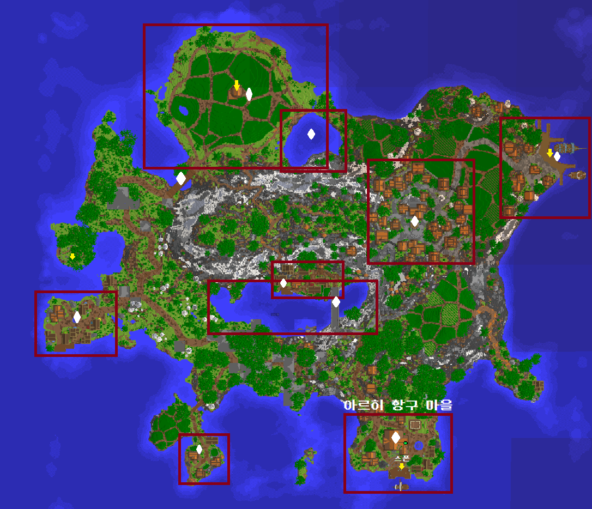

# 🌎 월드



<figure><figcaption></figcaption></figure>

명령어: /spawn

설명: 뭐 있는지 설명



#### 월드이동 방법

* 아무 곳에서 **/거주** 명령어 입력
* **Shift + F** 혹은 **/메뉴**에서 지구모양 > 잔디블록 클릭 

거주 서버는 몬스터 스폰이 <mark style="color:red;">**비활성화**</mark> 되어있고, <mark style="color:blue;">**초기화가 없는**</mark> 평화로운 서버입니다.\
그리고 <mark style="color:blue;">**부동산**</mark> 시스템이 적용되어 있어 소중한 건축물을 보호할 수 있습니다.\
또한, 여러 사람들과 함께 부동산을 공유하여 공동체 생활을 할 수도 있습니다.\
다만, 부동산이 설정되지 않은 지역은 블록을 <mark style="color:blue;">**설치**</mark>하거나 <mark style="color:blue;">**파괴**</mark>하는 활동이 <mark style="color:red;">**불가**</mark>합니다.\
마지막으로, 거주 서버에서는 구리던전,  딥다크 시티, 약탈자의 전초기지 등의 건축물 스폰이 <mark style="color:red;">**비활성화**</mark> 되어있습니다. 

부동산에 대한 자세한 설명은 아래 문서를 확인해 주세요.



#### 월드이동 방법

* 아무 곳에서 **/광질** 명령어 입력
* **Shift + F** 혹은 **/메뉴**에서 지구모양 > 돌블록 클릭 

자원 서버는 몬스터 스폰이 <mark style="color:green;">**활성화**</mark> 되어있고, <mark style="color:blue;">**초기화가 있는**</mark> 서버입니다.\
거주 서버와는 달리 원하는대로 블록을 <mark style="color:blue;">**설치**</mark>하거나 <mark style="color:blue;">**파괴**</mark>하는 활동이 <mark style="color:green;">**가능**</mark>합니다.\
또한, 플레이어의 스킬 레벨 상황에 따라 스폰되는 몬스터의 <mark style="color:blue;">**체력**</mark>이나 <mark style="color:blue;">**크기**</mark>가 달라지기 때문에 더욱 다이나믹한 야생 활동을 경험할 수 있습니다.

#### 오버월드

구리 던전, 딥다크 시티, 약탈자의 전초기지 등 다양한 건축물이 스폰됩니다.\
월드 크기: 3,000 x 3,000

#### 네더월드

오버월드에서 흑요석으로 네더 차원문을 만들어 이동해야 합니다.

월드 크기: 10,000 x 10,000

#### 엔더월드

오버월드에서 엔드 차원문을 찾아서 이동해야 합니다.

월드 크기: 10,000 x 10,000


