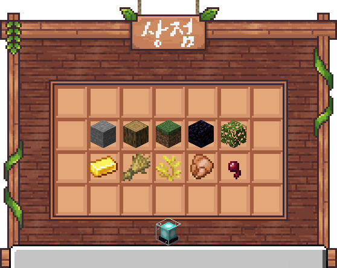

# 🏪 서버 상점

<figure><figcaption>
상점 메인메뉴 (/상점) 돌, 나무, 블록, 지옥/엔더, 식물 광물, 농작물, 바다, 음식, 전리품
</figcaption></figure>

|                   |                                                                                                                      |
| ----------------- | -------------------------------------------------------------------------------------------------------------------- |
| **/shop, /상점**    | 
서버 상점을 엽니다. <strong>좌클릭: 구매하기</strong> <strong>우클릭: 판매하기</strong>  <strong>쉬프트+우클릭: 전체 판매하기</strong>
 |
| **/sell1, /팔기1**  | 손에 든 아이템 모두를 판매합니다.                                                                                                  |
|  **/sell2, /팔기2** | 손에 든 아이템을 묶음으로 전체 판매합니다.                                                                                             |
| **/sell3, /팔기3**  | 상점에 판매 가능한 아이템 전부를 판매합니다.                                                                                            |
