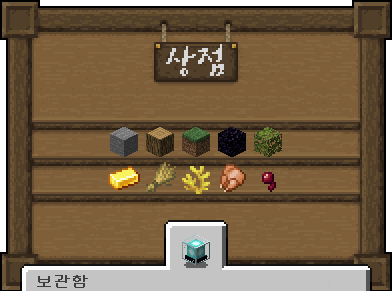

# 🏪 서버 상점

<figure><figcaption>
상점 메인메뉴 (/상점) 돌, 나무, 블록, 지옥/엔더, 식물 광물, 농작물, 바다, 음식, 전리품
</figcaption></figure>

|               |                                                    |
| ------------- | -------------------------------------------------- |
| /shop, /상점    | 
상점 서버 상점 열기 좌클릭: 구매 우클릭: 판매 휠클릭: 인벤전체 판매
 |
| /sell1, /팔기1  | 손에 든 아이템 판매                                        |
|  /sell2, /팔기2 | 손에 든 아이템 인벤토리에 있는 것 전체 판매                          |
| /sell3, /팔기3  | 상점에 판매 가능한 아이템 전체 판매                               |
