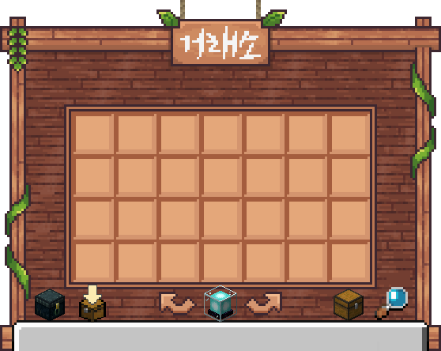

# 💵 거래소

<figure><figcaption></figcaption></figure>


거래소 이용은 <mark style="color:blue;">**스폰 서버**</mark>에서만 가능합니다.



거래소 최대 등록 갯수는 [등급](../main-contents/rank.md)에 따라 상이하며,\
아이템 등록 후 <mark style="color:blue;">**3일**</mark> 경과 시 아이템이 만료됩니다.


<table><thead><tr><th width="204">명령어</th><th width="572.3333333333333">설명</th></tr></thead><tbody><tr><td><strong>/ah, /거래소</strong></td><td>서버 거래소를 엽니다.</td></tr><tr><td><strong>/ah sell [금액] [갯수]</strong> <strong>/거래등록 [금액] [갯수]</strong></td><td>손에 든 아이템을 거래소에 등록합니다.</td></tr><tr><td><strong>/ah history [page]</strong> <strong>/거래소내역</strong></td><td>거래소에서 거래한 내역을 확인합니다.</td></tr><tr><td><strong>/ah claim</strong></td><td></td></tr><tr><td><strong>/ah expire</strong></td><td>만료된 품목을 확인합니다.</td></tr><tr><td><strong>/ah buying</strong></td><td>구매한 품목을 확인합니다.</td></tr><tr><td><strong>/ah items</strong></td><td>판매 중인 내 아이템을 확인합니다.</td></tr></tbody></table>

### 🔎 거래소 검색


<mark style="color:blue;">**/ah search \[키워드]**</mark> 명령어를 입력하여 아이템을 검색할 수 있습니다. (아이템 종류, 이름, 설명, 판매자 검색)


#### 고급 검색

**/ah search name::<아이템 이름>** → 해당 아이템 이름과 정확히 일치하는 아이템을 검색합니다.\
&#xNAN;**/ah search lore::<아이템 설명>** → 해당 아이템 설명과 정확히 일치하는 아이템을 검색합니다.\
&#xNAN;**/ah search seller::<판매자 이름>** → 해당 판매자가 판매하는 아이템을 검색합니다.

<table><thead><tr><th width="120" align="center">검색 기호</th><th width="188.33333333333331">설명</th><th>사용 예시</th></tr></thead><tbody><tr><td align="center"><code>:=</code></td><td>포함하는</td><td><code>/ah search name:=Diamond</code></td></tr><tr><td align="center"><code>::</code></td><td>일치하는</td><td><code>/ah search name::Diamond</code></td></tr><tr><td align="center"><code>:></code></td><td>대소문자 구분 없음</td><td><code>/ah search name:>Diamond</code></td></tr></tbody></table>

### 🍯 거래소꿀팁

#### 표지판 명령어

표지판에 **/ah search seller::<본인 닉네임>** 적은 후 위에 버튼을 설치하면 \
버튼을 누를 때마다 판매 중인 아이템을 확인할 수 있습니다.

#### 스폰 홍보 매대 (준비중)
