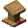
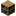
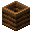
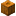
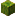
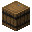
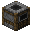
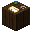
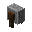
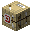

# 💁 주민거래



##  사서


<mark style="color:red;">**사서 주민 거래 품목 중 수선책은 제거되었습니다!**</mark>


<table data-full-width="false"><thead><tr><th width="96" align="center">등급</th><th width="283" align="center">요구 아이템</th><th width="242" align="center">획득 아이템</th><th align="center">재고</th></tr></thead><tbody><tr><td align="center">초심자</td><td align="center">종이 24 에메랄드 5 앵무조개 껍데기 + 책</td><td align="center">에메랄드 1 책장 1 마법이 부여된 책</td><td align="center">16 12 12</td></tr><tr><td align="center">수습생</td><td align="center">책 4 에메랄드 5 앵무조개 껍데기 + 책</td><td align="center">에메랄드 3 랜턴 1 마법이 부여된 책</td><td align="center">16 12 12</td></tr><tr><td align="center">기능공</td><td align="center">먹물 12 에메랄드 1 앵무조개 껍데기 + 책</td><td align="center">에메랄드 1 유리판 20 마법이 부여된 책</td><td align="center">12 12 12</td></tr><tr><td align="center">전문가</td><td align="center">책과 깃펜 1 에메랄드 20 에메랄드 15 앵무조개 껍데기 + 책</td><td align="center">에메랄드 1 시계 1 나침반 1 마법이 부여된 책</td><td align="center">12 12 12 12</td></tr><tr><td align="center">달인</td><td align="center">에메랄드 10 에메랄드 1</td><td align="center">이름표 1 깃털 64</td><td align="center">12 12</td></tr></tbody></table>

## 마법이 부여된 책 가격

<table><thead><tr><th width="95.66666666666666" align="center">레벨</th><th align="center">앵무조개 껍데기</th><th align="center">책</th></tr></thead><tbody><tr><td align="center">Ⅰ </td><td align="center"> 1-3 중 랜덤</td><td align="center"> x 1</td></tr><tr><td align="center">Ⅱ</td><td align="center"> 4-6 중 랜덤</td><td align="center"> x 1</td></tr><tr><td align="center">Ⅲ</td><td align="center"> 7-9 중 랜덤</td><td align="center"> x 1</td></tr><tr><td align="center">Ⅳ</td><td align="center"> 10-12 중 랜덤</td><td align="center"> x 1</td></tr><tr><td align="center">Ⅴ</td><td align="center"> 13-15 중 랜덤</td><td align="center"> x 1</td></tr></tbody></table>



##  농부

<table data-full-width="false"><thead><tr><th width="96" align="center">등급</th><th width="283" align="center">요구 아이템</th><th width="242" align="center">획득 아이템</th><th align="center">재고</th></tr></thead><tbody><tr><td align="center">초심자</td><td align="center">밀 10 감자 50 당근 50 비트 10 에메랄드 10</td><td align="center">에메랄드 3 에메랄드 5 에메랄드 5 에메랄드 3 빵 1</td><td align="center">16 16 16 16 16</td></tr><tr><td align="center">수습생</td><td align="center">
호박 10

호박 파이 10 사과 1
</td><td align="center">에메랄드 3 에메랄드 7 에메랄드 10</td><td align="center">12 12 12</td></tr><tr><td align="center">기능공</td><td align="center">수박 10 에메랄드 2</td><td align="center">에메랄드 3 쿠키 1</td><td align="center">12 12</td></tr><tr><td align="center">전문가</td><td align="center">케이크 1 에메랄드 3</td><td align="center">에메랄드 6 꿀이 든 병 1</td><td align="center">3 12</td></tr><tr><td align="center">달인</td><td align="center">에메랄드 5 에메랄드 5</td><td align="center">황금 당근 1 반짝이는 수박 조각 1</td><td align="center">12 12</td></tr></tbody></table>



##  어부

<table data-full-width="false"><thead><tr><th width="96" align="center">등급</th><th width="283" align="center">요구 아이템</th><th width="242" align="center">획득 아이템</th><th align="center">재고</th></tr></thead><tbody><tr><td align="center">초심자</td><td align="center">종이 24 에메랄드 5 앵무조개 껍데기 + 책</td><td align="center">에메랄드 1 책장 1 마법이 부여된 책</td><td align="center">16 12 12</td></tr><tr><td align="center">수습생</td><td align="center">책 4 에메랄드 5 앵무조개 껍데기 + 책</td><td align="center">에메랄드 3 랜턴 1 마법이 부여된 책</td><td align="center">16 12 12</td></tr><tr><td align="center">기능공</td><td align="center">먹물 12 에메랄드 1 앵무조개 껍데기 + 책</td><td align="center">에메랄드 1 유리판 20 마법이 부여된 책</td><td align="center">12 12 12</td></tr><tr><td align="center">전문가</td><td align="center">책과 깃펜 1 에메랄드 20 에메랄드 15 앵무조개 껍데기 + 책</td><td align="center">에메랄드 1 시계 1 나침반 1 마법이 부여된 책</td><td align="center">12 12 12 12</td></tr><tr><td align="center">달인</td><td align="center">에메랄드 10 에메랄드 1</td><td align="center">이름표 1 깃털 64</td><td align="center">12 12</td></tr></tbody></table>



## 석공

<table data-full-width="false"><thead><tr><th width="96" align="center">등급</th><th width="283" align="center">요구 아이템</th><th width="242" align="center">획득 아이템</th><th align="center">재고</th></tr></thead><tbody><tr><td align="center">초심자</td><td align="center">종이 24 에메랄드 5 앵무조개 껍데기 + 책</td><td align="center">에메랄드 1 책장 1 마법이 부여된 책</td><td align="center">16 12 12</td></tr><tr><td align="center">수습생</td><td align="center">책 4 에메랄드 5 앵무조개 껍데기 + 책</td><td align="center">에메랄드 3 랜턴 1 마법이 부여된 책</td><td align="center">16 12 12</td></tr><tr><td align="center">기능공</td><td align="center">먹물 12 에메랄드 1 앵무조개 껍데기 + 책</td><td align="center">에메랄드 1 유리판 20 마법이 부여된 책</td><td align="center">12 12 12</td></tr><tr><td align="center">전문가</td><td align="center">책과 깃펜 1 에메랄드 20 에메랄드 15 앵무조개 껍데기 + 책</td><td align="center">에메랄드 1 시계 1 나침반 1 마법이 부여된 책</td><td align="center">12 12 12 12</td></tr><tr><td align="center">달인</td><td align="center">에메랄드 10 에메랄드 1</td><td align="center">이름표 1 깃털 64</td><td align="center">12 12</td></tr></tbody></table>



## 성직자

<table data-full-width="false"><thead><tr><th width="96" align="center">등급</th><th width="283" align="center">요구 아이템</th><th width="242" align="center">획득 아이템</th><th align="center">재고</th></tr></thead><tbody><tr><td align="center">초심자</td><td align="center">종이 24 에메랄드 5 앵무조개 껍데기 + 책</td><td align="center">에메랄드 1 책장 1 마법이 부여된 책</td><td align="center">16 12 12</td></tr><tr><td align="center">수습생</td><td align="center">책 4 에메랄드 5 앵무조개 껍데기 + 책</td><td align="center">에메랄드 3 랜턴 1 마법이 부여된 책</td><td align="center">16 12 12</td></tr><tr><td align="center">기능공</td><td align="center">먹물 12 에메랄드 1 앵무조개 껍데기 + 책</td><td align="center">에메랄드 1 유리판 20 마법이 부여된 책</td><td align="center">12 12 12</td></tr><tr><td align="center">전문가</td><td align="center">책과 깃펜 1 에메랄드 20 에메랄드 15 앵무조개 껍데기 + 책</td><td align="center">에메랄드 1 시계 1 나침반 1 마법이 부여된 책</td><td align="center">12 12 12 12</td></tr><tr><td align="center">달인</td><td align="center">에메랄드 10 에메랄드 1</td><td align="center">이름표 1 깃털 64</td><td align="center">12 12</td></tr></tbody></table>



## 양치기

<table data-full-width="false"><thead><tr><th width="96" align="center">등급</th><th width="283" align="center">요구 아이템</th><th width="242" align="center">획득 아이템</th><th align="center">재고</th></tr></thead><tbody><tr><td align="center">초심자</td><td align="center">종이 24 에메랄드 5 앵무조개 껍데기 + 책</td><td align="center">에메랄드 1 책장 1 마법이 부여된 책</td><td align="center">16 12 12</td></tr><tr><td align="center">수습생</td><td align="center">책 4 에메랄드 5 앵무조개 껍데기 + 책</td><td align="center">에메랄드 3 랜턴 1 마법이 부여된 책</td><td align="center">16 12 12</td></tr><tr><td align="center">기능공</td><td align="center">먹물 12 에메랄드 1 앵무조개 껍데기 + 책</td><td align="center">에메랄드 1 유리판 20 마법이 부여된 책</td><td align="center">12 12 12</td></tr><tr><td align="center">전문가</td><td align="center">책과 깃펜 1 에메랄드 20 에메랄드 15 앵무조개 껍데기 + 책</td><td align="center">에메랄드 1 시계 1 나침반 1 마법이 부여된 책</td><td align="center">12 12 12 12</td></tr><tr><td align="center">달인</td><td align="center">에메랄드 10 에메랄드 1</td><td align="center">이름표 1 깃털 64</td><td align="center">12 12</td></tr></tbody></table>



##  도살업자

<table data-full-width="false"><thead><tr><th width="96" align="center">등급</th><th width="283" align="center">요구 아이템</th><th width="242" align="center">획득 아이템</th><th align="center">재고</th></tr></thead><tbody><tr><td align="center">초심자</td><td align="center">종이 24 에메랄드 5 앵무조개 껍데기 + 책</td><td align="center">에메랄드 1 책장 1 마법이 부여된 책</td><td align="center">16 12 12</td></tr><tr><td align="center">수습생</td><td align="center">책 4 에메랄드 5 앵무조개 껍데기 + 책</td><td align="center">에메랄드 3 랜턴 1 마법이 부여된 책</td><td align="center">16 12 12</td></tr><tr><td align="center">기능공</td><td align="center">먹물 12 에메랄드 1 앵무조개 껍데기 + 책</td><td align="center">에메랄드 1 유리판 20 마법이 부여된 책</td><td align="center">12 12 12</td></tr><tr><td align="center">전문가</td><td align="center">책과 깃펜 1 에메랄드 20 에메랄드 15 앵무조개 껍데기 + 책</td><td align="center">에메랄드 1 시계 1 나침반 1 마법이 부여된 책</td><td align="center">12 12 12 12</td></tr><tr><td align="center">달인</td><td align="center">에메랄드 10 에메랄드 1</td><td align="center">이름표 1 깃털 64</td><td align="center">12 12</td></tr></tbody></table>



##  지도 제작자

<table data-full-width="false"><thead><tr><th width="96" align="center">등급</th><th width="283" align="center">요구 아이템</th><th width="242" align="center">획득 아이템</th><th align="center">재고</th></tr></thead><tbody><tr><td align="center">초심자</td><td align="center">종이 24 에메랄드 5 앵무조개 껍데기 + 책</td><td align="center">에메랄드 1 책장 1 마법이 부여된 책</td><td align="center">16 12 12</td></tr><tr><td align="center">수습생</td><td align="center">책 4 에메랄드 5 앵무조개 껍데기 + 책</td><td align="center">에메랄드 3 랜턴 1 마법이 부여된 책</td><td align="center">16 12 12</td></tr><tr><td align="center">기능공</td><td align="center">먹물 12 에메랄드 1 앵무조개 껍데기 + 책</td><td align="center">에메랄드 1 유리판 20 마법이 부여된 책</td><td align="center">12 12 12</td></tr><tr><td align="center">전문가</td><td align="center">책과 깃펜 1 에메랄드 20 에메랄드 15 앵무조개 껍데기 + 책</td><td align="center">에메랄드 1 시계 1 나침반 1 마법이 부여된 책</td><td align="center">12 12 12 12</td></tr><tr><td align="center">달인</td><td align="center">에메랄드 10 에메랄드 1</td><td align="center">이름표 1 깃털 64</td><td align="center">12 12</td></tr></tbody></table>



## 가죽 세공인

<table data-full-width="false"><thead><tr><th width="96" align="center">등급</th><th width="283" align="center">요구 아이템</th><th width="242" align="center">획득 아이템</th><th align="center">재고</th></tr></thead><tbody><tr><td align="center">초심자</td><td align="center">종이 24 에메랄드 5 앵무조개 껍데기 + 책</td><td align="center">에메랄드 1 책장 1 마법이 부여된 책</td><td align="center">16 12 12</td></tr><tr><td align="center">수습생</td><td align="center">책 4 에메랄드 5 앵무조개 껍데기 + 책</td><td align="center">에메랄드 3 랜턴 1 마법이 부여된 책</td><td align="center">16 12 12</td></tr><tr><td align="center">기능공</td><td align="center">먹물 12 에메랄드 1 앵무조개 껍데기 + 책</td><td align="center">에메랄드 1 유리판 20 마법이 부여된 책</td><td align="center">12 12 12</td></tr><tr><td align="center">전문가</td><td align="center">책과 깃펜 1 에메랄드 20 에메랄드 15 앵무조개 껍데기 + 책</td><td align="center">에메랄드 1 시계 1 나침반 1 마법이 부여된 책</td><td align="center">12 12 12 12</td></tr><tr><td align="center">달인</td><td align="center">에메랄드 10 에메랄드 1</td><td align="center">이름표 1 깃털 64</td><td align="center">12 12</td></tr></tbody></table>



##  갑옷 제조인

<table data-full-width="false"><thead><tr><th width="96" align="center">등급</th><th width="283" align="center">요구 아이템</th><th width="242" align="center">획득 아이템</th><th align="center">재고</th></tr></thead><tbody><tr><td align="center">초심자</td><td align="center">종이 24 에메랄드 5 앵무조개 껍데기 + 책</td><td align="center">에메랄드 1 책장 1 마법이 부여된 책</td><td align="center">16 12 12</td></tr><tr><td align="center">수습생</td><td align="center">책 4 에메랄드 5 앵무조개 껍데기 + 책</td><td align="center">에메랄드 3 랜턴 1 마법이 부여된 책</td><td align="center">16 12 12</td></tr><tr><td align="center">기능공</td><td align="center">먹물 12 에메랄드 1 앵무조개 껍데기 + 책</td><td align="center">에메랄드 1 유리판 20 마법이 부여된 책</td><td align="center">12 12 12</td></tr><tr><td align="center">전문가</td><td align="center">책과 깃펜 1 에메랄드 20 에메랄드 15 앵무조개 껍데기 + 책</td><td align="center">에메랄드 1 시계 1 나침반 1 마법이 부여된 책</td><td align="center">12 12 12 12</td></tr><tr><td align="center">달인</td><td align="center">에메랄드 10 에메랄드 1</td><td align="center">이름표 1 깃털 64</td><td align="center">12 12</td></tr></tbody></table>



##  무기 대장장이

<table data-full-width="false"><thead><tr><th width="96" align="center">등급</th><th width="283" align="center">요구 아이템</th><th width="242" align="center">획득 아이템</th><th align="center">재고</th></tr></thead><tbody><tr><td align="center">초심자</td><td align="center">종이 24 에메랄드 5 앵무조개 껍데기 + 책</td><td align="center">에메랄드 1 책장 1 마법이 부여된 책</td><td align="center">16 12 12</td></tr><tr><td align="center">수습생</td><td align="center">책 4 에메랄드 5 앵무조개 껍데기 + 책</td><td align="center">에메랄드 3 랜턴 1 마법이 부여된 책</td><td align="center">16 12 12</td></tr><tr><td align="center">기능공</td><td align="center">먹물 12 에메랄드 1 앵무조개 껍데기 + 책</td><td align="center">에메랄드 1 유리판 20 마법이 부여된 책</td><td align="center">12 12 12</td></tr><tr><td align="center">전문가</td><td align="center">책과 깃펜 1 에메랄드 20 에메랄드 15 앵무조개 껍데기 + 책</td><td align="center">에메랄드 1 시계 1 나침반 1 마법이 부여된 책</td><td align="center">12 12 12 12</td></tr><tr><td align="center">달인</td><td align="center">에메랄드 10 에메랄드 1</td><td align="center">이름표 1 깃털 64</td><td align="center">12 12</td></tr></tbody></table>



## 도구 대장장이

<table data-full-width="false"><thead><tr><th width="96" align="center">등급</th><th width="283" align="center">요구 아이템</th><th width="242" align="center">획득 아이템</th><th align="center">재고</th></tr></thead><tbody><tr><td align="center">초심자</td><td align="center">종이 24 에메랄드 5 앵무조개 껍데기 + 책</td><td align="center">에메랄드 1 책장 1 마법이 부여된 책</td><td align="center">16 12 12</td></tr><tr><td align="center">수습생</td><td align="center">책 4 에메랄드 5 앵무조개 껍데기 + 책</td><td align="center">에메랄드 3 랜턴 1 마법이 부여된 책</td><td align="center">16 12 12</td></tr><tr><td align="center">기능공</td><td align="center">먹물 12 에메랄드 1 앵무조개 껍데기 + 책</td><td align="center">에메랄드 1 유리판 20 마법이 부여된 책</td><td align="center">12 12 12</td></tr><tr><td align="center">전문가</td><td align="center">책과 깃펜 1 에메랄드 20 에메랄드 15 앵무조개 껍데기 + 책</td><td align="center">에메랄드 1 시계 1 나침반 1 마법이 부여된 책</td><td align="center">12 12 12 12</td></tr><tr><td align="center">달인</td><td align="center">에메랄드 10 에메랄드 1</td><td align="center">이름표 1 깃털 64</td><td align="center">12 12</td></tr></tbody></table>



##  화살 제조인

<table data-full-width="false"><thead><tr><th width="96" align="center">등급</th><th width="283" align="center">요구 아이템</th><th width="242" align="center">획득 아이템</th><th align="center">재고</th></tr></thead><tbody><tr><td align="center">초심자</td><td align="center">종이 24 에메랄드 5 앵무조개 껍데기 + 책</td><td align="center">에메랄드 1 책장 1 마법이 부여된 책</td><td align="center">16 12 12</td></tr><tr><td align="center">수습생</td><td align="center">책 4 에메랄드 5 앵무조개 껍데기 + 책</td><td align="center">에메랄드 3 랜턴 1 마법이 부여된 책</td><td align="center">16 12 12</td></tr><tr><td align="center">기능공</td><td align="center">먹물 12 에메랄드 1 앵무조개 껍데기 + 책</td><td align="center">에메랄드 1 유리판 20 마법이 부여된 책</td><td align="center">12 12 12</td></tr><tr><td align="center">전문가</td><td align="center">책과 깃펜 1 에메랄드 20 에메랄드 15 앵무조개 껍데기 + 책</td><td align="center">에메랄드 1 시계 1 나침반 1 마법이 부여된 책</td><td align="center">12 12 12 12</td></tr><tr><td align="center">달인</td><td align="center">에메랄드 10 에메랄드 1</td><td align="center">이름표 1 깃털 64</td><td align="center">12 12</td></tr></tbody></table>



