# 💁 주민거래 \[작성 중]



## 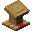 사서


<mark style="color:red;">**사서 주민 거래 품목 중 수선책은 제거되었습니다!**</mark>


<table data-full-width="false"><thead><tr><th width="96" align="center">등급</th><th width="283" align="center">요구 아이템</th><th width="242" align="center">획득 아이템</th><th align="center">재고</th></tr></thead><tbody><tr><td align="center">초심자</td><td align="center">종이 24 에메랄드 5 앵무조개 껍데기 + 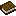책</td><td align="center">에메랄드 1 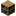책장 1 마법이 부여된 책</td><td align="center">16 12 12</td></tr><tr><td align="center">수습생</td><td align="center">책 4 에메랄드 5 앵무조개 껍데기 + 책</td><td align="center">에메랄드 3 랜턴 1 마법이 부여된 책</td><td align="center">16 12 12</td></tr><tr><td align="center">기능공</td><td align="center">먹물 주머니 12 에메랄드 1 앵무조개 껍데기 + 책</td><td align="center">에메랄드 1 유리판 20 마법이 부여된 책</td><td align="center">12 12 12</td></tr><tr><td align="center">전문가</td><td align="center">책과 깃펜 1 에메랄드 20 에메랄드 15 앵무조개 껍데기 + 책</td><td align="center">에메랄드 1 시계 1 나침반 1 마법이 부여된 책</td><td align="center">12 12 12 12</td></tr><tr><td align="center">달인</td><td align="center">에메랄드 10 에메랄드 1</td><td align="center">이름표 1 깃털 64</td><td align="center">12 12</td></tr></tbody></table>

## 마법이 부여된 책 가격

<table><thead><tr><th width="95.66666666666666" align="center">레벨</th><th align="center">앵무조개 껍데기</th><th align="center">책</th></tr></thead><tbody><tr><td align="center">Ⅰ </td><td align="center">1-3 중 랜덤</td><td align="center"> x 1</td></tr><tr><td align="center">Ⅱ</td><td align="center">4-6 중 랜덤</td><td align="center"> x 1</td></tr><tr><td align="center">Ⅲ</td><td align="center">7-9 중 랜덤</td><td align="center"> x 1</td></tr><tr><td align="center">Ⅳ</td><td align="center">10-12 중 랜덤</td><td align="center"> x 1</td></tr><tr><td align="center">Ⅴ</td><td align="center">13-15 중 랜덤</td><td align="center"> x 1</td></tr></tbody></table>



## 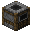 도살업자

<table data-full-width="false"><thead><tr><th width="96" align="center">등급</th><th width="298" align="center">요구 아이템</th><th width="242" align="center">획득 아이템</th><th align="center">재고</th></tr></thead><tbody><tr><td align="center">초심자</td><td align="center">익히지 않은 닭고기 5 익히지 않은 돼지고기 5 익히지 않은 토끼고기 5 에메랄드 2</td><td align="center">에메랄드 1 에메랄드 1 에메랄드 1 토끼 스튜 1</td><td align="center">16 16 16 12</td></tr><tr><td align="center">수습생</td><td align="center">
석탄 20

에메랄드 2 에메랄드 2
</td><td align="center">에메랄드 20 익힌  돼지고기 5 익힌  닭고기 5</td><td align="center">5 16 16</td></tr><tr><td align="center">기능공</td><td align="center">익히지 않은 대구 10 익히지 않은 양고기 5</td><td align="center">에메랄드 10 에메랄드 1</td><td align="center">16 16</td></tr><tr><td align="center">전문가</td><td align="center">익힌 토끼고기 5 익히지 않은 소고기 5</td><td align="center">에메랄드 2 에메랄드 1</td><td align="center">16 16</td></tr><tr><td align="center">달인</td><td align="center">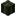말린 켈프 블록 15 달콤한 열매 50</td><td align="center">에메랄드 1 에메랄드 1</td><td align="center">12 12</td></tr></tbody></table>



## 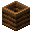 농부

<table data-full-width="false"><thead><tr><th width="96" align="center">등급</th><th width="283" align="center">요구 아이템</th><th width="242" align="center">획득 아이템</th><th align="center">재고</th></tr></thead><tbody><tr><td align="center">초심자</td><td align="center">밀 10 감자 50 당근 50 비트 10 에메랄드 10</td><td align="center">에메랄드 3 에메랄드 5 에메랄드 5 에메랄드 3 빵 1</td><td align="center">16 16 16 16 16</td></tr><tr><td align="center">수습생</td><td align="center">
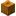호박 10

호박 파이 10 사과 1
</td><td align="center">에메랄드 3 에메랄드 7 에메랄드 10</td><td align="center">12 12 12</td></tr><tr><td align="center">기능공</td><td align="center">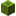수박 10 에메랄드 2</td><td align="center">에메랄드 3 쿠키 1</td><td align="center">12 12</td></tr><tr><td align="center">전문가</td><td align="center">케이크 1 에메랄드 3</td><td align="center">에메랄드 6 꿀이 든 병 1</td><td align="center">3 12</td></tr><tr><td align="center">달인</td><td align="center">에메랄드 5 에메랄드 5</td><td align="center">황금 당근 1 반짝이는 수박 조각 1</td><td align="center">12 12</td></tr></tbody></table>



## 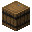 어부

<table data-full-width="false"><thead><tr><th width="96" align="center">등급</th><th width="332" align="center">요구 아이템</th><th width="232" align="center">획득 아이템</th><th align="center">재고</th></tr></thead><tbody><tr><td align="center">초심자</td><td align="center">실 20 석탄 20 익히지 않은 대구 2 + 에메랄드 1 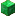에메랄드 블록 1 + 에메랄드 7</td><td align="center">에메랄드 5 에메랄드 20 익힌 대구 2 대구가 담긴 양동이 1</td><td align="center">16 5 16 16</td></tr><tr><td align="center">수습생</td><td align="center">
익히지 않은 대구 5

에메랄드 36
</td><td align="center">에메랄드 35 모닥불 1</td><td align="center">16 12</td></tr><tr><td align="center">기능공</td><td align="center">익히지 않은 연어 3 에메랄드 2</td><td align="center">에메랄드 42 낚싯대 1</td><td align="center">12 12</td></tr><tr><td align="center">전문가</td><td align="center">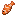열대어 1 익히지 않은 연어 2 + 에메랄드 1 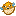복어 1</td><td align="center">에메랄드 블록 20 익힌 연어 2 에메랄드 36</td><td align="center">12 16 12</td></tr><tr><td align="center">달인</td><td align="center">앵무조개 껍데기 에메랄드 블록 21</td><td align="center">마법이 부여된 낚싯대 1 열대어가 담긴 양동이 1</td><td align="center">3 12</td></tr></tbody></table>



## 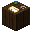 지도 제작자

<table data-full-width="false"><thead><tr><th width="96" align="center">등급</th><th width="283" align="center">요구 아이템</th><th width="242" align="center">획득 아이템</th><th align="center">재고</th></tr></thead><tbody><tr><td align="center">초심자</td><td align="center">종이 24 에메랄드 7</td><td align="center">에메랄드 1 빈지도 1</td><td align="center">16 12</td></tr><tr><td align="center">수습생</td><td align="center">에메랄드 1 에메랄드 5</td><td align="center"> 유리판 20 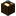지도 제작대 1</td><td align="center">16 12</td></tr><tr><td align="center">기능공</td><td align="center">나침반 1 에메랄드 20</td><td align="center">에메랄드 13 시계 1</td><td align="center">12 12</td></tr><tr><td align="center">전문가</td><td align="center">에메랄드 2 에메랄드 1</td><td align="center">아이템 액자 1 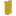현수막(랜덤색상) 1</td><td align="center">12 12</td></tr><tr><td align="center">달인</td><td align="center">에메랄드 8</td><td align="center">현수막 무늬(지구) 1</td><td align="center">12</td></tr></tbody></table>



## 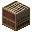 양치기

<table data-full-width="false"><thead><tr><th width="96" align="center">등급</th><th width="283" align="center">요구 아이템</th><th width="242" align="center">획득 아이템</th><th align="center">재고</th></tr></thead><tbody><tr><td align="center">초심자</td><td align="center">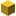양털(랜덤 색상) 64 에메랄드 2</td><td align="center">에메랄드 1 가위 1</td><td align="center">16 12</td></tr><tr><td align="center">수습생</td><td align="center">염료(랜덤 색상) 12 에메랄드 4 에메랄드 1</td><td align="center">에메랄드 1 양털(랜덤 색상) 1 양탄자(랜덤 색상) 5</td><td align="center">16 16 16</td></tr><tr><td align="center">기능공</td><td align="center">염료(랜덤 색상) 12 에메랄드 3</td><td align="center">에메랄드 1 침대(랜덤 색상) 1</td><td align="center">16 12</td></tr><tr><td align="center">전문가</td><td align="center">염료(랜덤 색상) 12 에메랄드 1</td><td align="center">에메랄드 1 현수막(랜덤 색상) 1</td><td align="center">16 12</td></tr><tr><td align="center">달인</td><td align="center">에메랄드 2</td><td align="center">그림 3</td><td align="center">12</td></tr></tbody></table>



## 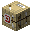 화살 제조인

<table data-full-width="false"><thead><tr><th width="96" align="center">등급</th><th width="283" align="center">요구 아이템</th><th width="242" align="center">획득 아이템</th><th align="center">재고</th></tr></thead><tbody><tr><td align="center">초심자</td><td align="center">막대기 100 에메랄드 1 에메랄드 1 + 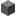자갈 1</td><td align="center">에메랄드 1 화살 16 부싯돌 10</td><td align="center">16 12 12</td></tr><tr><td align="center">수습생</td><td align="center">부싯돌 30 에메랄드 1</td><td align="center">에메랄드 1 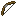활 1</td><td align="center">12 12</td></tr><tr><td align="center">기능공</td><td align="center">실 30 에메랄드 6</td><td align="center">에메랄드 5 쇠뇌 1</td><td align="center">12 12</td></tr><tr><td align="center">전문가</td><td align="center">깃털 100 앵무조개 껍데기</td><td align="center">에메랄드 1 마법이 부여된 활</td><td align="center">16 3</td></tr><tr><td align="center">달인</td><td align="center">앵무조개 껍데기 에메랄드 2</td><td align="center">마법이 부여된 쇠뇌 철사 덫 갈고리 1</td><td align="center">3 12</td></tr></tbody></table>



## 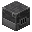 갑옷 제조인

<table data-full-width="false"><thead><tr><th width="96" align="center">등급</th><th width="283" align="center">요구 아이템</th><th width="242" align="center">획득 아이템</th><th align="center">재고</th></tr></thead><tbody><tr><td align="center">초심자</td><td align="center"></td><td align="center"></td><td align="center"></td></tr><tr><td align="center">수습생</td><td align="center"></td><td align="center"></td><td align="center"></td></tr><tr><td align="center">기능공</td><td align="center"></td><td align="center"></td><td align="center"></td></tr><tr><td align="center">전문가</td><td align="center"></td><td align="center"></td><td align="center"></td></tr><tr><td align="center">달인</td><td align="center"></td><td align="center"></td><td align="center"></td></tr></tbody></table>



## 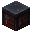 도구 대장장이

<table data-full-width="false"><thead><tr><th width="96" align="center">등급</th><th width="283" align="center">요구 아이템</th><th width="242" align="center">획득 아이템</th><th align="center">재고</th></tr></thead><tbody><tr><td align="center">초심자</td><td align="center"></td><td align="center"></td><td align="center"></td></tr><tr><td align="center">수습생</td><td align="center"></td><td align="center"></td><td align="center"></td></tr><tr><td align="center">기능공</td><td align="center"></td><td align="center"></td><td align="center"></td></tr><tr><td align="center">전문가</td><td align="center"></td><td align="center"></td><td align="center"></td></tr><tr><td align="center">달인</td><td align="center"></td><td align="center"></td><td align="center"></td></tr></tbody></table>



## 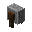 무기 대장장이

<table data-full-width="false"><thead><tr><th width="96" align="center">등급</th><th width="283" align="center">요구 아이템</th><th width="242" align="center">획득 아이템</th><th align="center">재고</th></tr></thead><tbody><tr><td align="center">초심자</td><td align="center"></td><td align="center"></td><td align="center"></td></tr><tr><td align="center">수습생</td><td align="center"></td><td align="center"></td><td align="center"></td></tr><tr><td align="center">기능공</td><td align="center"></td><td align="center"></td><td align="center"></td></tr><tr><td align="center">전문가</td><td align="center"></td><td align="center"></td><td align="center"></td></tr><tr><td align="center">달인</td><td align="center"></td><td align="center"></td><td align="center"></td></tr></tbody></table>



## 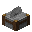 석공

<table data-full-width="false"><thead><tr><th width="96" align="center">등급</th><th width="283" align="center">요구 아이템</th><th width="242" align="center">획득 아이템</th><th align="center">재고</th></tr></thead><tbody><tr><td align="center">초심자</td><td align="center"></td><td align="center"></td><td align="center"></td></tr><tr><td align="center">수습생</td><td align="center"></td><td align="center"></td><td align="center"></td></tr><tr><td align="center">기능공</td><td align="center"></td><td align="center"></td><td align="center"></td></tr><tr><td align="center">전문가</td><td align="center"></td><td align="center"></td><td align="center"></td></tr><tr><td align="center">달인</td><td align="center"></td><td align="center"></td><td align="center"></td></tr></tbody></table>



## 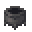 가죽 세공인

<table data-full-width="false"><thead><tr><th width="96" align="center">등급</th><th width="283" align="center">요구 아이템</th><th width="242" align="center">획득 아이템</th><th align="center">재고</th></tr></thead><tbody><tr><td align="center">초심자</td><td align="center"></td><td align="center"></td><td align="center"></td></tr><tr><td align="center">수습생</td><td align="center"></td><td align="center"></td><td align="center"></td></tr><tr><td align="center">기능공</td><td align="center"></td><td align="center"></td><td align="center"></td></tr><tr><td align="center">전문가</td><td align="center"></td><td align="center"></td><td align="center"></td></tr><tr><td align="center">달인</td><td align="center"></td><td align="center"></td><td align="center"></td></tr></tbody></table>



## 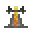 성직자

<table data-full-width="false"><thead><tr><th width="96" align="center">등급</th><th width="283" align="center">요구 아이템</th><th width="242" align="center">획득 아이템</th><th align="center">재고</th></tr></thead><tbody><tr><td align="center">초심자</td><td align="center"></td><td align="center"></td><td align="center"></td></tr><tr><td align="center">수습생</td><td align="center"></td><td align="center"></td><td align="center"></td></tr><tr><td align="center">기능공</td><td align="center"></td><td align="center"></td><td align="center"></td></tr><tr><td align="center">전문가</td><td align="center"></td><td align="center"></td><td align="center"></td></tr><tr><td align="center">달인</td><td align="center"></td><td align="center"></td><td align="center"></td></tr></tbody></table>



