# 💁 주민거래


**주민 및 떠돌이 상인의 거래 목록이 대폭 변경되었습니다.**\
**주민 직업별 상세 목록 및 가격은 아래 내용을 확인해 주세요.**\
\
<mark style="color:red;">**★ 감염 치료, 마을의 영웅을 포함한 모든 할인 시스템이 적용되지 않습니다.**</mark>\ <mark style="color:red;">**★ 감염 치료를 시도할 시 거래 목록이 전부 새롭게 변경되니 이 점 주의해 주세요.**</mark>\ <mark style="color:red;">**★ 마법이 부여된 아이템은 에메랄드가 아닌 앵무조개 껍데기로 거래가 가능합니다.**</mark>


## \[ 1 ] 떠돌이 상인 및 주민 직업별 거래 목록



## 떠돌이 상인


**수선책 거래는 사서 주민이 아닌 떠돌이 상인한테서 가능합니다!**


<table><thead><tr><th width="282" align="center">대표 아이템 (확률)</th><th width="318" align="center">요구 아이템</th><th align="center">재고</th></tr></thead><tbody><tr><td align="center">수선책 1개 (25%)</td><td align="center">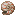앵무조개 껍데기 25  + 책</td><td align="center">1</td></tr><tr><td align="center">경험치병 5개 (75%)</td><td align="center">앵무조개 껍데기 1</td><td align="center">5</td></tr><tr><td align="center">열대어가 담긴 양동이 (100%)</td><td align="center">에메랄드 블록 21</td><td align="center">5</td></tr></tbody></table>

**그 외 다수**



##  사서


<mark style="color:red;">**사서 주민 거래 품목 중 수선책은 제거되었습니다!**</mark>


<table data-full-width="false"><thead><tr><th width="96" align="center">등급</th><th width="283" align="center">요구 아이템</th><th width="242" align="center">획득 아이템</th><th align="center">재고</th></tr></thead><tbody><tr><td align="center">초심자</td><td align="center">종이 24 에메랄드 5 앵무조개 껍데기 + 책</td><td align="center">에메랄드 1 책장 1 마법이 부여된 책</td><td align="center">16 12 12</td></tr><tr><td align="center">수습생</td><td align="center">책 4 에메랄드 5 앵무조개 껍데기 + 책</td><td align="center">에메랄드 3 랜턴 1 마법이 부여된 책</td><td align="center">16 12 12</td></tr><tr><td align="center">기능공</td><td align="center">먹물 주머니 12 에메랄드 1 앵무조개 껍데기 + 책</td><td align="center">에메랄드 1 유리판 20 마법이 부여된 책</td><td align="center">12 12 12</td></tr><tr><td align="center">전문가</td><td align="center">책과 깃펜 1 에메랄드 20 에메랄드 15 앵무조개 껍데기 + 책</td><td align="center">에메랄드 1 시계 1 나침반 1 마법이 부여된 책</td><td align="center">12 12 12 12</td></tr><tr><td align="center">달인</td><td align="center">에메랄드 10 에메랄드 1</td><td align="center">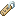이름표 1 깃털 64</td><td align="center">12 12</td></tr></tbody></table>



##  도살업자

<table data-full-width="false"><thead><tr><th width="96" align="center">등급</th><th width="298" align="center">요구 아이템</th><th width="242" align="center">획득 아이템</th><th align="center">재고</th></tr></thead><tbody><tr><td align="center">초심자</td><td align="center">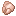익히지 않은 닭고기 5 익히지 않은 돼지고기 5 익히지 않은 토끼고기 5 에메랄드 2</td><td align="center">에메랄드 1 에메랄드 1 에메랄드 1 토끼 스튜</td><td align="center">16 16 16 12</td></tr><tr><td align="center">수습생</td><td align="center">
석탄 20

에메랄드 2 에메랄드 2
</td><td align="center">에메랄드 20 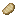익힌  돼지고기 5 익힌  닭고기 5</td><td align="center">5 16 16</td></tr><tr><td align="center">기능공</td><td align="center">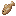익히지 않은 대구 10 익히지 않은 양고기 5</td><td align="center">에메랄드 10 에메랄드 1</td><td align="center">16 16</td></tr><tr><td align="center">전문가</td><td align="center">익힌 토끼고기 5 익히지 않은 소고기 5</td><td align="center">에메랄드 2 에메랄드 1</td><td align="center">16 16</td></tr><tr><td align="center">달인</td><td align="center">말린 켈프 블록 15 달콤한 열매 50</td><td align="center">에메랄드 1 에메랄드 1</td><td align="center">12 12</td></tr></tbody></table>



##  농부

<table data-full-width="false"><thead><tr><th width="96" align="center">등급</th><th width="244" align="center">요구 아이템</th><th width="242" align="center">획득 아이템</th><th align="center">재고</th></tr></thead><tbody><tr><td align="center">초심자</td><td align="center">밀 10 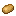감자 50 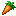당근 50 비트 10 에메랄드 10</td><td align="center">에메랄드 3 에메랄드 5 에메랄드 5 에메랄드 3 빵 1</td><td align="center">16 16 16 16 16</td></tr><tr><td align="center">수습생</td><td align="center">
호박 10

호박 파이 10 사과 1
</td><td align="center">에메랄드 3 에메랄드 7 에메랄드 10</td><td align="center">12 12 12</td></tr><tr><td align="center">기능공</td><td align="center">수박 10 에메랄드 2</td><td align="center">에메랄드 3 쿠키 1</td><td align="center">12 12</td></tr><tr><td align="center">전문가</td><td align="center">케이크 1 에메랄드 3</td><td align="center">에메랄드 6 꿀이 든 병 1</td><td align="center">3 12</td></tr><tr><td align="center">달인</td><td align="center">에메랄드 5 에메랄드 5</td><td align="center">황금 당근 1 반짝이는 수박 조각 1</td><td align="center">12 12</td></tr></tbody></table>



##  어부

<table data-full-width="false"><thead><tr><th width="97" align="center">등급</th><th width="307" align="center">요구 아이템</th><th width="225" align="center">획득 아이템</th><th align="center">재고</th></tr></thead><tbody><tr><td align="center">초심자</td><td align="center">실 20 석탄 20 익히지 않은 대구 2 + 에메랄드 1 에메랄드 블록 1 + 에메랄드 7</td><td align="center">에메랄드 5 에메랄드 20 익힌 대구 2 대구가 담긴 양동이</td><td align="center">16 5 16 5</td></tr><tr><td align="center">수습생</td><td align="center">
익히지 않은 대구 5

에메랄드 36
</td><td align="center">에메랄드 35 모닥불 1</td><td align="center">16 12</td></tr><tr><td align="center">기능공</td><td align="center">익히지 않은 연어 3 에메랄드 2</td><td align="center">에메랄드 42 낚싯대</td><td align="center">12 12</td></tr><tr><td align="center">전문가</td><td align="center">열대어 1 익히지 않은 연어 2 + 에메랄드 1 복어 1</td><td align="center">에메랄드 블록 20 익힌 연어 2 에메랄드 36</td><td align="center">12 16 12</td></tr><tr><td align="center">달인</td><td align="center">앵무조개 껍데기 에메랄드 블록 21</td><td align="center">마법이 부여된 낚싯대 열대어가 담긴 양동이</td><td align="center">3 1</td></tr></tbody></table>



##  지도 제작자

<table data-full-width="false"><thead><tr><th width="96" align="center">등급</th><th width="283" align="center">요구 아이템</th><th width="242" align="center">획득 아이템</th><th align="center">재고</th></tr></thead><tbody><tr><td align="center">초심자</td><td align="center">종이 24 에메랄드 7</td><td align="center">에메랄드 1 빈 지도 1</td><td align="center">16 12</td></tr><tr><td align="center">수습생</td><td align="center">에메랄드 1 에메랄드 5</td><td align="center">유리판 20 지도 제작대</td><td align="center">16 12</td></tr><tr><td align="center">기능공</td><td align="center">나침반 1 에메랄드 20</td><td align="center">에메랄드 13 시계 1</td><td align="center">12 12</td></tr><tr><td align="center">전문가</td><td align="center">에메랄드 2 에메랄드 1</td><td align="center">아이템 액자 1 현수막(랜덤색상) 1</td><td align="center">12 12</td></tr><tr><td align="center">달인</td><td align="center">에메랄드 8</td><td align="center">현수막 무늬(지구)</td><td align="center">12</td></tr></tbody></table>



##  양치기

<table data-full-width="false"><thead><tr><th width="96" align="center">등급</th><th width="283" align="center">요구 아이템</th><th width="242" align="center">획득 아이템</th><th align="center">재고</th></tr></thead><tbody><tr><td align="center">초심자</td><td align="center">양털(랜덤 색상) 64 에메랄드 2</td><td align="center">에메랄드 1 가위</td><td align="center">16 12</td></tr><tr><td align="center">수습생</td><td align="center">염료(랜덤 색상) 12 에메랄드 4 에메랄드 1</td><td align="center">에메랄드 1 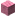양털(랜덤 색상) 1 양탄자(랜덤 색상) 5</td><td align="center">16 16 16</td></tr><tr><td align="center">기능공</td><td align="center">염료(랜덤 색상) 12 에메랄드 3</td><td align="center">에메랄드 1 침대(랜덤 색상)</td><td align="center">16 12</td></tr><tr><td align="center">전문가</td><td align="center">염료(랜덤 색상) 12 에메랄드 1</td><td align="center">에메랄드 1 현수막(랜덤 색상) 1</td><td align="center">16 12</td></tr><tr><td align="center">달인</td><td align="center">에메랄드 2</td><td align="center">그림 3</td><td align="center">12</td></tr></tbody></table>



##  화살 제조인

<table data-full-width="false"><thead><tr><th width="96" align="center">등급</th><th width="283" align="center">요구 아이템</th><th width="242" align="center">획득 아이템</th><th align="center">재고</th></tr></thead><tbody><tr><td align="center">초심자</td><td align="center">막대기 100 에메랄드 1 에메랄드 1 + 자갈 1</td><td align="center">에메랄드 1 화살 16 부싯돌 10</td><td align="center">16 12 12</td></tr><tr><td align="center">수습생</td><td align="center">부싯돌 30 에메랄드 1</td><td align="center">에메랄드 1 활</td><td align="center">12 12</td></tr><tr><td align="center">기능공</td><td align="center">실 30 에메랄드 6</td><td align="center">에메랄드 5 쇠뇌</td><td align="center">12 12</td></tr><tr><td align="center">전문가</td><td align="center">깃털 100 앵무조개 껍데기</td><td align="center">에메랄드 1 마법이 부여된 활</td><td align="center">16 3</td></tr><tr><td align="center">달인</td><td align="center">앵무조개 껍데기 에메랄드 2</td><td align="center">마법이 부여된 쇠뇌 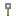철사 덫 갈고리 1</td><td align="center">3 12</td></tr></tbody></table>



##  갑옷 제조인

<table data-full-width="false"><thead><tr><th width="96" align="center">등급</th><th width="215" align="center">요구 아이템</th><th width="324" align="center">획득 아이템</th><th align="center">재고</th></tr></thead><tbody><tr><td align="center">초심자</td><td align="center">석탄 20 에메랄드 15 에메랄드 24 에메랄드 21 에메랄드 12</td><td align="center">에메랄드 20 철 투구 철 흉갑 철 레깅스 철 부츠</td><td align="center">5 12 12 12 12</td></tr><tr><td align="center">수습생</td><td align="center">철 주괴 3 에메랄드 20 에메랄드 21 에메랄드 12</td><td align="center">에메랄드 9 종 1 사슬 레깅스 사슬 부츠</td><td align="center">5 12 12 12</td></tr><tr><td align="center">기능공</td><td align="center">용암 양동이 다이아몬드 1 에메랄드 15 에메랄드 24 에메랄드 4</td><td align="center">에메랄드 1 에메랄드 20 사슬 투구 사슬 흉갑 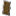방패</td><td align="center">12 12 12 12 12</td></tr><tr><td align="center">전문가</td><td align="center">앵무조개 껍데기 앵무조개 껍데기</td><td align="center">마법이 부여된 다이아몬드 레깅스 마법이 부여된 다이아몬드 부츠</td><td align="center">3 3</td></tr><tr><td align="center">달인</td><td align="center">앵무조개 껍데기 앵무조개 껍데기</td><td align="center">마법이 부여된 다이아몬드 투구 마법이 부여된 다이아몬드 흉갑</td><td align="center">3 3</td></tr></tbody></table>



##  도구 대장장이

<table data-full-width="false"><thead><tr><th width="96" align="center">등급</th><th width="217" align="center">요구 아이템</th><th width="320" align="center">획득 아이템</th><th align="center">재고</th></tr></thead><tbody><tr><td align="center">초심자</td><td align="center">석탄 20 에메랄드 1 에메랄드 1 에메랄드 1 에메랄드 1</td><td align="center">에메랄드 20 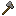돌 도끼 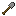돌 삽 돌 곡괭이 돌 괭이</td><td align="center">5 12 12 12 12</td></tr><tr><td align="center">수습생</td><td align="center">철 주괴 3 에메랄드 20</td><td align="center">에메랄드 9 종 1</td><td align="center">5 12</td></tr><tr><td align="center">기능공</td><td align="center">부싯돌 30 앵무조개 껍데기 앵무조개 껍데기 앵무조개 껍데기 에메랄드 40</td><td align="center">에메랄드 1 마법이 부여된 철 도끼 마법이 부여된 철 삽 마법이 부여된 철 곡괭이 다이아몬드 괭이</td><td align="center">12 3 3 3 3</td></tr><tr><td align="center">전문가</td><td align="center">다이아몬드 1 앵무조개 껍데기</td><td align="center">에메랄드 20 마법이 부여된 다이아몬드 도끼</td><td align="center">12 3</td></tr><tr><td align="center">달인</td><td align="center">앵무조개 껍데기 앵무조개 껍데기</td><td align="center">마법이 부여된 다이아몬드 삽 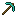마법이 부여된 다이아몬드 곡괭이</td><td align="center">3 3</td></tr></tbody></table>



##  무기 대장장이

<table data-full-width="false"><thead><tr><th width="96" align="center">등급</th><th width="235" align="center">요구 아이템</th><th width="286" align="center">획득 아이템</th><th align="center">재고</th></tr></thead><tbody><tr><td align="center">초심자</td><td align="center">석탄 20 에메랄드 9 앵무조개 껍데기</td><td align="center">에메랄드 20 철 도끼 마법이 부여된 철 검</td><td align="center">5 12 3</td></tr><tr><td align="center">수습생</td><td align="center">철 주괴 3 에메랄드 20</td><td align="center">에메랄드 9 종 1</td><td align="center">5 12</td></tr><tr><td align="center">기능공</td><td align="center">부싯돌 30 구리 주괴 20</td><td align="center">에메랄드 1 에메랄드 10</td><td align="center">12 5</td></tr><tr><td align="center">전문가</td><td align="center">다이아몬드 1 에메랄드 60</td><td align="center">에메랄드 20 다이아몬드 도끼</td><td align="center">12 3</td></tr><tr><td align="center">달인</td><td align="center">앵무조개 껍데기 앵무조개 껍데기</td><td align="center">마법이 부여된 다이아몬드 도끼 마법이 부여된 다이아몬드 검</td><td align="center">3 3</td></tr></tbody></table>



##  석공

<table data-full-width="false"><thead><tr><th width="96" align="center">등급</th><th width="256" align="center">요구 아이템</th><th width="271" align="center">획득 아이템</th><th align="center">재고</th></tr></thead><tbody><tr><td align="center">초심자</td><td align="center">점토 덩이 12 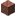벽돌 12</td><td align="center">에메랄드 1 에메랄드 1</td><td align="center">16 16</td></tr><tr><td align="center">수습생</td><td align="center">에메랄드 1 에메랄드 1</td><td align="center">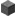돌 5 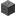조각된 석재 벽돌 5</td><td align="center">16 16</td></tr><tr><td align="center">기능공</td><td align="center">에메랄드 1 에메랄드 1 에메랄드 1 에메랄드 1 에메랄드 1 에메랄드 1</td><td align="center">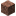화강암 5 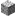섬록암 5 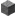안산암 5 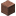윤나는 화강암 5 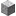윤나는 섬록암 5 윤나는 안산암 5</td><td align="center">16 16 16 16 16 16</td></tr><tr><td align="center">전문가</td><td align="center">네더 석영 100 에메랄드 1 에메랄드 1</td><td align="center">에메랄드 1 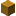테라코타(랜덤 색상) 5 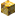유광 테라코타(랜덤 색상) 1</td><td align="center">12 12 12</td></tr><tr><td align="center">달인</td><td align="center">에메랄드 1 에메랄드 1</td><td align="center">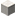석영 기둥 2 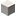석영 블록 2</td><td align="center">12 12</td></tr></tbody></table>



##  가죽 세공인

<table data-full-width="false"><thead><tr><th width="96" align="center">등급</th><th width="283" align="center">요구 아이템</th><th width="242" align="center">획득 아이템</th><th align="center">재고</th></tr></thead><tbody><tr><td align="center">초심자</td><td align="center">가죽 1 에메랄드 7 에메랄드 8</td><td align="center">에메랄드 1 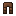가죽 바지 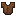가죽 조끼</td><td align="center">16 12 12</td></tr><tr><td align="center">수습생</td><td align="center">부싯돌 30 에메랄드 5 에메랄드 4</td><td align="center">에메랄드 1 가죽 모자 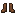가죽 장화</td><td align="center">12 12 12</td></tr><tr><td align="center">기능공</td><td align="center">토끼 가죽 4 에메랄드 8</td><td align="center">에메랄드 1 가죽 조끼</td><td align="center">12 12</td></tr><tr><td align="center">전문가</td><td align="center">인갑 4 에메랄드 5</td><td align="center">에메랄드 1 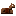가죽 말 갑옷</td><td align="center">12 12</td></tr><tr><td align="center">달인</td><td align="center">에메랄드 5 에메랄드 5</td><td align="center">안장 가죽 모자</td><td align="center">12 12</td></tr></tbody></table>



##  성직자

<table data-full-width="false"><thead><tr><th width="96" align="center">등급</th><th width="283" align="center">요구 아이템</th><th width="242" align="center">획득 아이템</th><th align="center">재고</th></tr></thead><tbody><tr><td align="center">초심자</td><td align="center">썩은 살점 20 에메랄드 10</td><td align="center">에메랄드 2 레드스톤 가루 1</td><td align="center">16 12</td></tr><tr><td align="center">수습생</td><td align="center">금 주괴 2 에메랄드 10</td><td align="center">에메랄드 8 청금석 1</td><td align="center">5 12</td></tr><tr><td align="center">기능공</td><td align="center">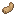토끼발 1 에메랄드 2</td><td align="center">에메랄드 3 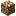발광석 1</td><td align="center">12 12</td></tr><tr><td align="center">전문가</td><td align="center">인갑 4 유리병 15 에메랄드 3</td><td align="center">에메랄드 1 에메랄드 1 엔더 진주 1</td><td align="center">12 12 12</td></tr><tr><td align="center">달인</td><td align="center">네더 사마귀 50 <mark style="color:red;"><strong>[거래불가]</strong></mark> <del><em>앵무조개 껍데기 1</em></del></td><td align="center">에메랄드 5 <mark style="color:red;"><strong>[거래불가]</strong></mark> <del><em>경험치 병 5</em></del></td><td align="center">12 <mark style="color:red;"><strong>X</strong></mark></td></tr></tbody></table>



## \[ 2 ] 마법이 부여된 아이템 가격

<table><thead><tr><th width="188" align="center">레벨</th><th align="center">요구 아이템</th></tr></thead><tbody><tr><td align="center">Ⅰ </td><td align="center">1-3 중 랜덤</td></tr><tr><td align="center">Ⅱ</td><td align="center">4-6 중 랜덤</td></tr><tr><td align="center">Ⅲ</td><td align="center">7-9 중 랜덤</td></tr><tr><td align="center">Ⅳ</td><td align="center">10-12 중 랜덤</td></tr><tr><td align="center">Ⅴ</td><td align="center">13-15 중 랜덤</td></tr></tbody></table>

