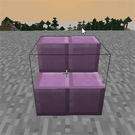
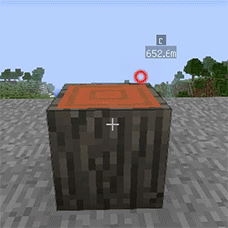
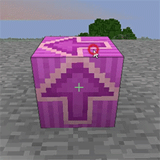

# 🔄 블록 회전


계단, 원목, 유광 테라코타 등을 +으로 회전할 수 있습니다.



부동산 내에서는 <mark style="color:blue;">**설치(place),**</mark> <mark style="color:blue;">**파괴(destroy)**</mark> 플래그 권한이 없으면 회전이 <mark style="color:red;">**불가**</mark>합니다.


<figure><figcaption></figcaption></figure> <figure><figcaption></figcaption></figure> <figure><figcaption></figcaption></figure>

