# 🎣 낚시


코나 아일랜드에서는 <mark style="color:blue;">**전용 낚싯대**</mark>를 사용하여 여러 종류의 <mark style="color:blue;">**커스텀 물고기**</mark>를 낚을 수 있습니다.\
커스텀 물고기 또한 종류별로 <mark style="color:red;">**등급**</mark>이 나뉘어져 있으니 아래 내용을 확인해 주세요.


### 낚싯대 등급

낚싯대의 등급은 **초보자**, **중급**, **고급**, **달인**, **강태공**의 낚싯대로 총 <mark style="color:blue;">**5개**</mark>입니다.



####  초보자 낚싯대

해당 낚싯대는 누구나 사용할 수 있습니다.

#### 낚싯대 효과

* 일반 등급 <mark style="color:blue;">**100%**</mark>



####  중급 낚싯대

해당 낚싯대는 어부 [**직업**](../../jobs/) 레벨 <mark style="color:blue;">**20**</mark> 이상부터 사용할 수 있습니다.

#### 낚싯대 효과

* 희귀 등급 <mark style="color:blue;">**5%**</mark>
* 일반 등급 <mark style="color:blue;">**95%**</mark>



####  고급 낚싯대

해당 낚싯대는 어부 [**직업**](../../jobs/) 레벨 <mark style="color:blue;">**40**</mark> 이상부터 사용할 수 있습니다.

#### 낚싯대 효과

* 영웅 등급 <mark style="color:blue;">**5%**</mark>
* 희귀 등급 <mark style="color:blue;">**10%**</mark>
* 일반 등급 <mark style="color:blue;">**85%**</mark>



####  달인의 낚싯대

해당 낚싯대는 어부 [**직업**](../../jobs/) 레벨 <mark style="color:blue;">**60**</mark> 이상부터 사용할 수 있습니다.

#### 낚싯대 효과

* 전설 등급 <mark style="color:blue;">**1%**</mark>
* 영웅 등급 <mark style="color:blue;">**6%**</mark>
* 희귀 등급 <mark style="color:blue;">**93%**</mark>



####  강태공의 낚싯대

해당 낚싯대는 어부 [**직업**](../../jobs/) 레벨 <mark style="color:blue;">**80**</mark> 이상부터 사용할 수 있습니다.

#### 낚싯대 효과

* 전설 등급 <mark style="color:blue;">**2%**</mark>
* 영웅 등급 <mark style="color:blue;">**8%**</mark>
* 희귀 등급 <mark style="color:blue;">**90%**</mark>



### 낚시 미니게임

커스텀 물고기의 <mark style="color:blue;">**희귀 등급**</mark> 이상부터는 미니게임을 <mark style="color:green;">**클리어**</mark> 해야 물고기를 낚을 수 있습니다.\
미니게임 종류는 **댄스**, **경주**, **당기기**로 총 <mark style="color:blue;">**3종류**</mark>입니다.\
낚이는 커스텀 물고기의 <mark style="color:blue;">**등급**</mark>에 따라 미니게임 난이도가 <mark style="color:red;">**상이**</mark>합니다.\
※ [**낚시 대회**](competition.md) 때는 미니게임이 <mark style="color:red;">**비활성화**</mark> 됩니다.



<figure>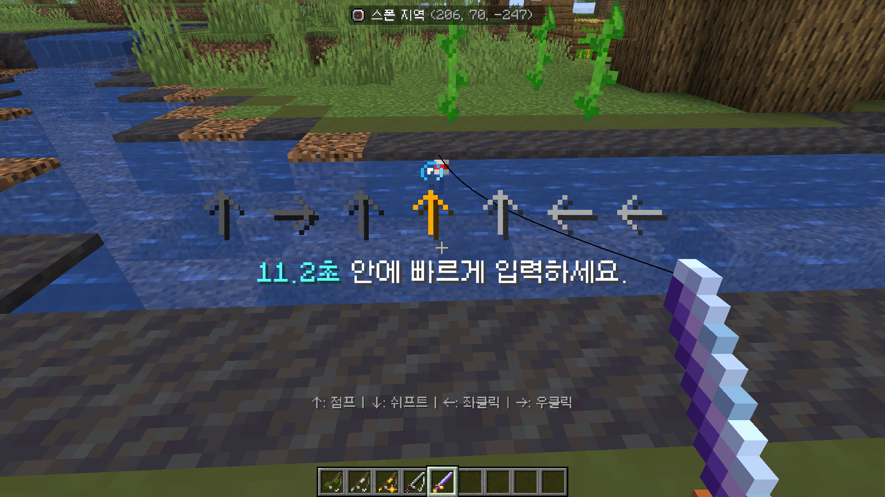<figcaption></figcaption></figure>

#### 클리어 방법

<mark style="color:blue;">**15초**</mark> 안에 화면에 표시된 방향키에 맞는 조작키를 누릅니다.\
←왼쪽: <mark style="color:blue;">**좌클릭**</mark> | →오른쪽: <mark style="color:blue;">**우클릭**</mark> | ↓아래: <mark style="color:blue;">**Shift**</mark>(웅크리기) | ↑위: <mark style="color:blue;">**스페이스 바**</mark>(점프)



<figure>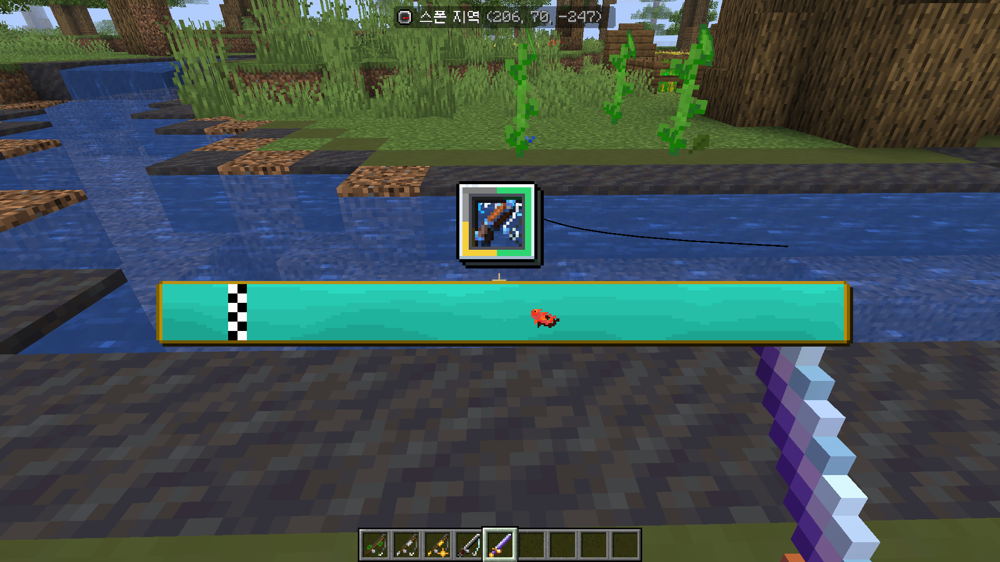<figcaption></figcaption></figure>

#### 클리어 방법

왼쪽 <mark style="color:blue;">**Shift 키**</mark>를 눌렀다 떼며 화면에 표시된 <mark style="color:red;">**게이지가 다 차지 않도록**</mark> 주의합니다.



<figure><figcaption></figcaption></figure>

#### 클리어 방법

왼쪽 <mark style="color:blue;">**Shift 키**</mark>를 눌렀다 떼며 포인터가 최대한 <mark style="color:green;">**초록색 바에 닿도록**</mark> 유지합니다.



### 커스텀 물고기 등급

커스텀 물고기의 등급은 **일반**, **희귀**, **영웅**, **전설**로 총 <mark style="color:blue;">**4개**</mark>입니다.




#### 판매 수익: <mark style="color:blue;">36원</mark>

#### 물고기 목록

<table><thead><tr><th width="350">바다</th><th>민물</th></tr></thead><tbody><tr><td>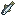 멸치</td><td>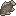 잉어</td></tr><tr><td>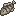 임연수어</td><td>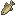 버들치</td></tr><tr><td>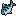 고등어</td><td> 미꾸라지</td></tr><tr><td> 갈치</td><td>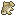 붕어</td></tr><tr><td>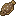 가자미</td><td>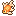 금붕어</td></tr><tr><td> 날치</td><td> 동자개</td></tr><tr><td>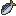 전어</td><td>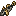 동사리</td></tr><tr><td> 전갱이</td><td>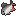 끄리</td></tr><tr><td>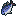 삼치</td><td>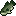 큰입배스</td></tr><tr><td>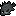 우럭</td><td>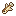 피라미</td></tr><tr><td>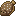 넙치</td><td>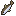 빙어</td></tr><tr><td> 청어</td><td>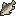 무지개송어</td></tr><tr><td>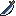 꽁치</td><td>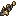 꺽정이</td></tr><tr><td>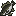 농어</td><td>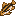 황어</td></tr><tr><td>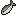 정어리</td><td>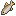 살치</td></tr><tr><td>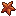 불가사리</td><td>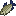 누치</td></tr><tr><td>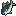 참치</td><td> 돌고기</td></tr><tr><td>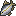 방어</td><td>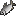 은어</td></tr></tbody></table>




#### 판매 수익: <mark style="color:blue;">175원</mark>

#### 물고기 목록

<table><thead><tr><th width="350">바다</th><th>민물</th></tr></thead><tbody><tr><td>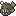 초롱아귀</td><td>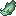 아로와나</td></tr><tr><td>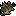 볼락</td><td>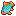 납줄개</td></tr><tr><td>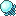 푸른 해파리</td><td>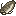 메기</td></tr><tr><td> 블루탱</td><td>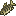 산천어</td></tr><tr><td> 만새기</td><td> 비단잉어</td></tr><tr><td>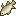 가숭어</td><td> 글래스캣피쉬</td></tr><tr><td> 문어</td><td>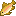 금송어</td></tr><tr><td>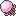 분홍 해파리</td><td> 꺽지</td></tr><tr><td>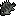 감성돔</td><td>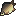 향어</td></tr><tr><td>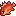 노랑눈우럭</td><td>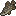 강꼬치고기</td></tr><tr><td>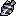 돌돔</td><td>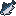 연어</td></tr><tr><td> 개복치</td><td>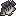 틸라피아</td></tr></tbody></table>




#### 판매 수익: <mark style="color:blue;">1,225원</mark>

#### 물고기 목록

<table><thead><tr><th width="350">바다</th><th>민물</th></tr></thead><tbody><tr><td> 청새치</td><td> 아프리카매너티</td></tr><tr><td>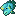 나폴레옹피쉬</td><td>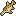 앨리게이터가아</td></tr><tr><td> 실러캔스</td><td> 자이언트 구라미</td></tr><tr><td> 듀공</td><td> 황쏘가리</td></tr><tr><td> 백상아리</td><td> 뱀장어</td></tr><tr><td> 다금바리</td><td> 가물치</td></tr><tr><td> 돗돔</td><td> 주걱철갑상어</td></tr><tr><td> 황새치</td><td> 피라니아</td></tr><tr><td> 뱀상어</td><td> 피라루쿠</td></tr><tr><td> 고래상어</td><td> 철갑상어</td></tr></tbody></table>




#### 판매 수익: <mark style="color:blue;">3,675원</mark>

#### 물고기 목록 (추가 예정)

<table><thead><tr><th width="350">바다</th><th>민물</th></tr></thead><tbody><tr><td></td><td> 무지개 물고기</td></tr><tr><td></td><td> 숲고기</td></tr></tbody></table>


