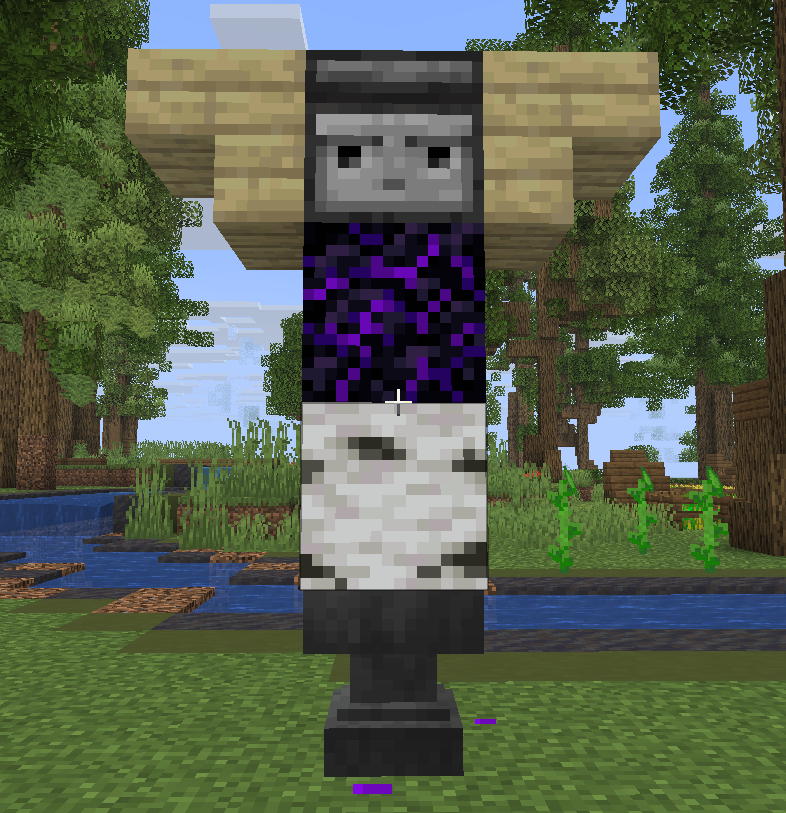

# 낚시 토템


낚시 토템을 설치하여 특별한 효과를 받아보세요.


### 토템 설치 방법

<figure><figcaption></figcaption></figure>

**모루**, **관측기**, **우는 흑요석**, 아무 종류의 **나무 원목**, 아무 종류의 **나무 계단**이 필요합니다.\
사진과 같이 모루 > 원목 > 우는 흑요석 > 계단 | 관측기(앞면) | 계단 순으로 설치하면 됩니다.

### 토템 활성화 방법

어부 [**직업**](../../jobs/) 레벨 <mark style="color:blue;">**40**</mark> 이상 달성 후에 앵무조개 껍데기 <mark style="color:blue;">**64개**</mark>를 들고 토템을 <mark style="color:blue;">**우클릭**</mark> 합니다.

### 토템 활성화 범위

토템이 설치된 곳 기준으로 반경 <mark style="color:blue;">**8블록**</mark> 떨어진 지점에 파티클이 생성됩니다.\
해당 범위 내에서만 토템 효과를 받을 수 있습니다.

<figure><figcaption></figcaption></figure>

### 토템 활성화 효과

* &#x20; 영웅 등급 확률 <mark style="color:blue;">**1.5배**</mark>

