# 직업 상점

### **직업 상점 기본 정보**


다양한 직업 활동을 통해 레벨을 올리고, <mark style="color:blue;">**포인트**</mark>를 벌어서 직업 상점에 있는 아이템을 구매해 보세요.\
각 직업별로 <mark style="color:blue;">**30/50/70**</mark> 레벨에 달성 시 새로운 아이템의 잠금이 해제됩니다.


<figure>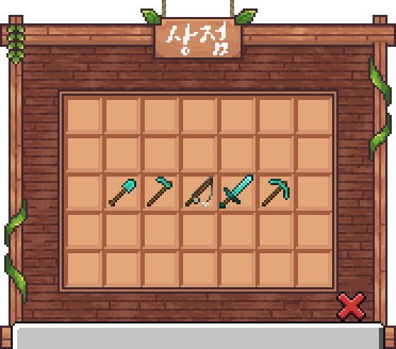<figcaption></figcaption></figure>

### 직업별 상점 품목



#### **30레벨**

<table><thead><tr><th width="224">품목</th><th width="240.33333333333326">수량</th><th>가격</th></tr></thead><tbody><tr><td> 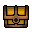 일반 등급 디거의 상자</td><td>1개</td><td>10,000포인트 ※ 40레벨 달성 시 <mark style="color:red;"><strong>10%</strong></mark> 할인!</td></tr><tr><td>  일반 등급 디거의 상자</td><td>10개</td><td>100,000포인트 ※ 40레벨 달성 시 <mark style="color:red;"><strong>10%</strong></mark> 할인!</td></tr></tbody></table>

#### **50레벨**

<table><thead><tr><th width="224">품목</th><th width="240.33333333333326">수량</th><th>가격</th></tr></thead><tbody><tr><td>  희귀 등급 디거의 상자</td><td>1개</td><td>100,000포인트 ※ 60레벨 달성 시 <mark style="color:red;"><strong>10%</strong></mark> 할인!</td></tr><tr><td>  희귀 등급 디거의 상자</td><td>10개</td><td>1,000,000포인트 ※ 60레벨 달성 시 <mark style="color:red;"><strong>10%</strong></mark> 할인!</td></tr></tbody></table>

#### **70레벨**

<table><thead><tr><th width="224">품목</th><th width="240.33333333333326">수량</th><th>가격</th></tr></thead><tbody><tr><td> 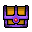 영웅 등급 디거의 상자</td><td>1개</td><td>1,000,000포인트 ※ 80레벨 달성 시 <mark style="color:red;"><strong>10%</strong></mark> 할인!</td></tr><tr><td>  영웅 등급 디거의 상자</td><td>10개</td><td>10,000,000포인트 ※ 80레벨 달성 시 <mark style="color:red;"><strong>10%</strong></mark> 할인!</td></tr></tbody></table>



#### **30레벨**

<table><thead><tr><th width="224">품목</th><th width="240.33333333333326">수량</th><th>가격</th></tr></thead><tbody><tr><td>  일반 등급 농부의 상자</td><td>1개</td><td>10,000포인트 ※ 40레벨 달성 시 <mark style="color:red;"><strong>10%</strong></mark> 할인!</td></tr><tr><td>  일반 등급 농부의 상자</td><td>10개</td><td>100,000포인트 ※ 40레벨 달성 시 <mark style="color:red;"><strong>10%</strong></mark> 할인!</td></tr></tbody></table>

#### **50레벨**

<table><thead><tr><th width="224">품목</th><th width="240.33333333333326">수량</th><th>가격</th></tr></thead><tbody><tr><td> 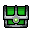 희귀 등급 농부의 상자</td><td>1개</td><td>100,000포인트 ※ 60레벨 달성 시 <mark style="color:red;"><strong>10%</strong></mark> 할인!</td></tr><tr><td>  희귀 등급 농부의 상자</td><td>10개</td><td>1,000,000포인트 ※ 60레벨 달성 시 <mark style="color:red;"><strong>10%</strong></mark> 할인!</td></tr></tbody></table>

#### **70레벨**

<table><thead><tr><th width="224">품목</th><th width="240.33333333333326">수량</th><th>가격</th></tr></thead><tbody><tr><td>  영웅 등급 농부의 상자</td><td>1개</td><td>1,000,000포인트 ※ 80레벨 달성 시 <mark style="color:red;"><strong>10%</strong></mark> 할인!</td></tr><tr><td>  영웅 등급 농부의 상자</td><td>10개</td><td>10,000,000포인트 ※ 80레벨 달성 시 <mark style="color:red;"><strong>10%</strong></mark> 할인!</td></tr></tbody></table>



#### **30레벨**

<table><thead><tr><th width="224">품목</th><th width="240.33333333333326">수량</th><th>가격</th></tr></thead><tbody><tr><td> 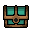 일반 등급 어부의 상자</td><td>1개</td><td>10,000포인트 ※ 40레벨 달성 시 <mark style="color:red;"><strong>10%</strong></mark> 할인!</td></tr><tr><td>  일반 등급 어부의 상자</td><td>10개</td><td>100,000포인트 ※ 40레벨 달성 시 <mark style="color:red;"><strong>10%</strong></mark> 할인!</td></tr></tbody></table>

#### **50레벨**

<table><thead><tr><th width="224">품목</th><th width="240.33333333333326">수량</th><th>가격</th></tr></thead><tbody><tr><td> 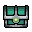 희귀 등급 어부의 상자</td><td>1개</td><td>100,000포인트 ※ 60레벨 달성 시 <mark style="color:red;"><strong>10%</strong></mark> 할인!</td></tr><tr><td>  희귀 등급 어부의 상자</td><td>10개</td><td>1,000,000포인트 ※ 60레벨 달성 시 <mark style="color:red;"><strong>10%</strong></mark> 할인!</td></tr></tbody></table>

#### **70레벨**

<table><thead><tr><th width="224">품목</th><th width="240.33333333333326">수량</th><th>가격</th></tr></thead><tbody><tr><td> 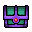 영웅 등급 어부의 상자</td><td>1개</td><td>1,000,000포인트 ※ 80레벨 달성 시 <mark style="color:red;"><strong>10%</strong></mark> 할인!</td></tr><tr><td>  영웅 등급 어부의 상자</td><td>10개</td><td>10,000,000포인트 ※ 80레벨 달성 시 <mark style="color:red;"><strong>10%</strong></mark> 할인!</td></tr></tbody></table>



#### **30레벨**

<table><thead><tr><th width="234">품목</th><th width="240.33333333333326">수량</th><th>가격</th></tr></thead><tbody><tr><td> 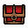 일반 등급 사냥꾼의 상자</td><td>1개</td><td>10,000포인트 ※ 40레벨 달성 시 <mark style="color:red;"><strong>10%</strong></mark> 할인!</td></tr><tr><td>  일반 등급 사냥꾼의 상자</td><td>10개</td><td>100,000포인트 ※ 40레벨 달성 시 <mark style="color:red;"><strong>10%</strong></mark> 할인!</td></tr></tbody></table>

#### **50레벨**

<table><thead><tr><th width="234">품목</th><th width="240.33333333333326">수량</th><th>가격</th></tr></thead><tbody><tr><td> 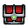 일반 등급 사냥꾼의 상자</td><td>1개</td><td>100,000포인트 ※ 60레벨 달성 시 <mark style="color:red;"><strong>10%</strong></mark> 할인!</td></tr><tr><td>  일반 등급 사냥꾼의 상자</td><td>10개</td><td>1,000,000포인트 ※ 60레벨 달성 시 <mark style="color:red;"><strong>10%</strong></mark> 할인!</td></tr></tbody></table>

#### **70레벨**

<table><thead><tr><th width="234">품목</th><th width="240.33333333333326">수량</th><th>가격</th></tr></thead><tbody><tr><td> 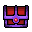 일반 등급 사냥꾼의 상자</td><td>1개</td><td>1,000,000포인트 ※ 80레벨 달성 시 <mark style="color:red;"><strong>10%</strong></mark> 할인!</td></tr><tr><td>  일반 등급 사냥꾼의 상자</td><td>10개</td><td>10,000,000포인트 ※ 80레벨 달성 시 <mark style="color:red;"><strong>10%</strong></mark> 할인!</td></tr></tbody></table>



#### **30레벨**

<table><thead><tr><th width="224">품목</th><th width="240.33333333333326">수량</th><th>가격</th></tr></thead><tbody><tr><td> 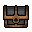 일반 등급 광부의 상자</td><td>1개</td><td>10,000포인트 ※ 40레벨 달성 시 <mark style="color:red;"><strong>10%</strong></mark> 할인!</td></tr><tr><td>  일반 등급 광부의 상자</td><td>10개</td><td>100,000포인트 ※ 40레벨 달성 시 <mark style="color:red;"><strong>10%</strong></mark> 할인!</td></tr></tbody></table>

#### **50레벨**

<table><thead><tr><th width="224">품목</th><th width="240.33333333333326">수량</th><th>가격</th></tr></thead><tbody><tr><td> 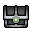 희귀 등급 광부의 상자</td><td>1개</td><td>100,000포인트 ※ 60레벨 달성 시 <mark style="color:red;"><strong>10%</strong></mark> 할인!</td></tr><tr><td>  희귀 등급 광부의 상자</td><td>10개</td><td>1,000,000포인트 ※ 60레벨 달성 시 <mark style="color:red;"><strong>10%</strong></mark> 할인!</td></tr></tbody></table>

#### **70레벨**

<table><thead><tr><th width="224">품목</th><th width="240.33333333333326">수량</th><th>가격</th></tr></thead><tbody><tr><td> 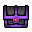 영웅 등급 광부의 상자</td><td>1개</td><td>1,000,000포인트 ※ 80레벨 달성 시 <mark style="color:red;"><strong>10%</strong></mark> 할인!</td></tr><tr><td>  영웅 등급 광부의 상자</td><td>10개</td><td>10,000,000포인트 ※ 80레벨 달성 시 <mark style="color:red;"><strong>10%</strong></mark> 할인!</td></tr></tbody></table>



### 직업별 상자 종류



####  일반 등급

<table><thead><tr><th width="354">아이템</th><th>확률</th></tr></thead><tbody><tr><td>  광물 랜덤 박스 1개</td><td>40%</td></tr><tr><td>  섬세한 손길 1개</td><td>5%</td></tr><tr><td>  발굴 모험 +1,000숙련도 쿠폰 1개</td><td>2%</td></tr><tr><td>  직업 포인트 복권 5개</td><td>2%</td></tr><tr><td>  희귀 등급 디거의 상자 1개</td><td>5%</td></tr></tbody></table>

####  희귀 등급

<table><thead><tr><th width="354">아이템</th><th>확률</th></tr></thead><tbody><tr><td>  광물 랜덤 박스 3개</td><td>40%</td></tr><tr><td>  발굴 모험 +5,000숙련도 쿠폰 1개</td><td>1%</td></tr><tr><td>  발굴 능력 초기화 쿠폰 1개</td><td>0.1%</td></tr><tr><td>  영웅 등급 디거의 상자 1개</td><td>3%</td></tr></tbody></table>

####  영웅 등급

<table><thead><tr><th width="354">아이템</th><th>확률</th></tr></thead><tbody><tr><td>  광물 랜덤 박스 9개</td><td>40%</td></tr><tr><td> 발굴 능력 초기화 쿠폰 2개</td><td>0.5%</td></tr><tr><td>  발굴 모험 +50,000숙련도 쿠폰 1개</td><td>0.1%</td></tr><tr><td> 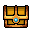 전설 등급 디거의 상자 1개</td><td>1%</td></tr></tbody></table>

####  전설 등급

<table><thead><tr><th width="354">아이템</th><th>확률</th></tr></thead><tbody><tr><td>  광물 랜덤 박스 27개</td><td>40%</td></tr><tr><td>  모험 숙련도 배수 패키지 1개</td><td>3%</td></tr><tr><td>  발굴 모험 +50,000숙련도 쿠폰 1개</td><td>0.5%</td></tr></tbody></table>



####  일반 등급

<table><thead><tr><th width="354">아이템</th><th>확률</th></tr></thead><tbody><tr><td>  광물 랜덤 박스 1개</td><td>40%</td></tr><tr><td>  농사 모험 +1,000숙련도 쿠폰 1개</td><td>2%</td></tr><tr><td>  직업 포인트 복권 5개</td><td>2%</td></tr><tr><td>  희귀 등급 농부의 상자 1개</td><td>5%</td></tr></tbody></table>

####  희귀 등급

<table><thead><tr><th width="354">아이템</th><th>확률</th></tr></thead><tbody><tr><td>  광물 랜덤 박스 3개</td><td>40%</td></tr><tr><td>  농사 모험 +5,000숙련도 쿠폰 1개</td><td>1%</td></tr><tr><td> 농사 능력 초기화 쿠폰 1개</td><td>0.1%</td></tr><tr><td>  영웅 등급 농부의 상자 1개</td><td>3%</td></tr></tbody></table>

####  영웅 등급

<table><thead><tr><th width="354">아이템</th><th>확률</th></tr></thead><tbody><tr><td>  광물 랜덤 박스 9개</td><td>40%</td></tr><tr><td> 농사 능력 초기화 쿠폰 2개</td><td>0.5%</td></tr><tr><td>  농사 모험 +50,000숙련도 쿠폰 1개</td><td>0.1%</td></tr><tr><td> 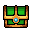 전설 등급 농부의 상자 1개</td><td>1%</td></tr></tbody></table>

####  전설 등급

<table><thead><tr><th width="354">아이템</th><th>확률</th></tr></thead><tbody><tr><td>  광물 랜덤 박스 27개</td><td>40%</td></tr><tr><td>  모험 숙련도 배수 패키지 1개</td><td>3%</td></tr><tr><td>  농사 모험 +50,000숙련도 쿠폰 1개</td><td>0.5%</td></tr></tbody></table>



####  일반 등급

<table><thead><tr><th width="354">아이템</th><th>확률</th></tr></thead><tbody><tr><td>  광물 랜덤 박스 1개</td><td>40%</td></tr><tr><td>  낚시 모험 +1,000숙련도 쿠폰 1개</td><td>2%</td></tr><tr><td>  직업 포인트 복권 5개</td><td>2%</td></tr><tr><td>  희귀 등급 어부의 상자 1개</td><td>5%</td></tr></tbody></table>

####  희귀 등급

<table><thead><tr><th width="354">아이템</th><th>확률</th></tr></thead><tbody><tr><td>  광물 랜덤 박스 3개</td><td>40%</td></tr><tr><td>  낚시 모험 +5,000숙련도 쿠폰 1개</td><td>1%</td></tr><tr><td> 낚시 능력 초기화 쿠폰 1개</td><td>0.1%</td></tr><tr><td>  영웅 등급 어부의 상자 1개</td><td>3%</td></tr></tbody></table>

####  영웅 등급

<table><thead><tr><th width="354">아이템</th><th>확률</th></tr></thead><tbody><tr><td>  광물 랜덤 박스 9개</td><td>40%</td></tr><tr><td> 낚시 능력 초기화 쿠폰 2개</td><td>0.5%</td></tr><tr><td>  낚시 모험 +50,000숙련도 쿠폰 1개</td><td>0.1%</td></tr><tr><td> 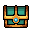 전설 등급 어부의 상자 1개</td><td>1%</td></tr></tbody></table>

####  전설 등급

<table><thead><tr><th width="354">아이템</th><th>확률</th></tr></thead><tbody><tr><td>  광물 랜덤 박스 27개</td><td>40%</td></tr><tr><td>  모험 숙련도 배수 패키지 1개</td><td>3%</td></tr><tr><td>  낚시 모험 +5,000숙련도 쿠폰 1개</td><td>0.5%</td></tr></tbody></table>



####  일반 등급

<table><thead><tr><th width="354">아이템</th><th>확률</th></tr></thead><tbody><tr><td>  광물 랜덤 박스 1개</td><td>40%</td></tr><tr><td>  전투 모험 +1,000숙련도 쿠폰 1개</td><td>2%</td></tr><tr><td>  직업 포인트 복권 5개</td><td>2%</td></tr><tr><td>  희귀 등급 사냥꾼의 상자 1개</td><td>5%</td></tr></tbody></table>

####  희귀 등급

<table><thead><tr><th width="354">아이템</th><th>확률</th></tr></thead><tbody><tr><td>  광물 랜덤 박스 3개</td><td>40%</td></tr><tr><td>  전투 모험 +5,000숙련도 쿠폰 1개</td><td>1%</td></tr><tr><td> 모험 능력 초기화 쿠폰 1개</td><td>0.1%</td></tr><tr><td>  영웅 등급 사냥꾼의 상자 1개</td><td>3%</td></tr></tbody></table>

####  영웅 등급

<table><thead><tr><th width="354">아이템</th><th>확률</th></tr></thead><tbody><tr><td>  광물 랜덤 박스 9개</td><td>40%</td></tr><tr><td> 모험 능력 초기화 쿠폰 2개</td><td>0.5%</td></tr><tr><td>  전투 모험 +50,000숙련도 쿠폰 1개</td><td>0.1%</td></tr><tr><td> 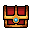 전설 등급 사냥꾼의 상자 1개</td><td>1%</td></tr></tbody></table>

####  전설 등급

<table><thead><tr><th width="354">아이템</th><th>확률</th></tr></thead><tbody><tr><td>  광물 랜덤 박스 27개</td><td>40%</td></tr><tr><td>  모험 숙련도 배수 패키지 1개</td><td>3%</td></tr><tr><td>  전투 모험 +5,000숙련도 쿠폰 1개</td><td>0.5%</td></tr></tbody></table>



####  일반 등급

<table><thead><tr><th width="354">아이템</th><th>확률</th></tr></thead><tbody><tr><td>  광물 랜덤 박스 1개</td><td>40%</td></tr><tr><td>  채광 모험 +1,000숙련도 쿠폰 1개</td><td>2%</td></tr><tr><td>  직업 포인트 복권 5개</td><td>2%</td></tr><tr><td>  희귀 등급 광부의 상자 1개</td><td>5%</td></tr></tbody></table>

####  희귀 등급

<table><thead><tr><th width="354">아이템</th><th>확률</th></tr></thead><tbody><tr><td>  광물 랜덤 박스 3개</td><td>40%</td></tr><tr><td>  채광 모험 +5,000숙련도 쿠폰 1개</td><td>1%</td></tr><tr><td> 채광 능력 초기화 쿠폰 1개</td><td>0.1%</td></tr><tr><td>  영웅 등급 광부의 상자 1개</td><td>3%</td></tr></tbody></table>

####  영웅 등급

<table><thead><tr><th width="354">아이템</th><th>확률</th></tr></thead><tbody><tr><td>  광물 랜덤 박스 9개</td><td>40%</td></tr><tr><td> 채광 능력 초기화 쿠폰 2개</td><td>0.5%</td></tr><tr><td>  채광 모험 +50,000숙련도 쿠폰 1개</td><td>0.1%</td></tr><tr><td> 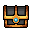 전설 등급 광부의 상자 1개</td><td>1%</td></tr></tbody></table>

####  전설 등급

<table><thead><tr><th width="354">아이템</th><th>확률</th></tr></thead><tbody><tr><td>  광물 랜덤 박스 27개</td><td>40%</td></tr><tr><td>  모험 숙련도 배수 패키지 1개</td><td>3%</td></tr><tr><td>  채광 모험 +5,000숙련도 쿠폰 1개</td><td>0.5%</td></tr></tbody></table>


