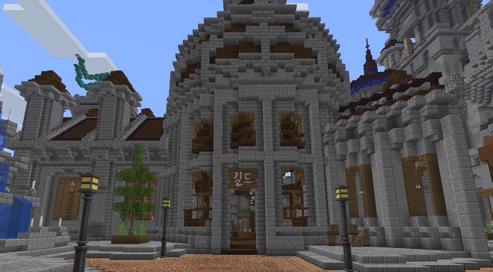
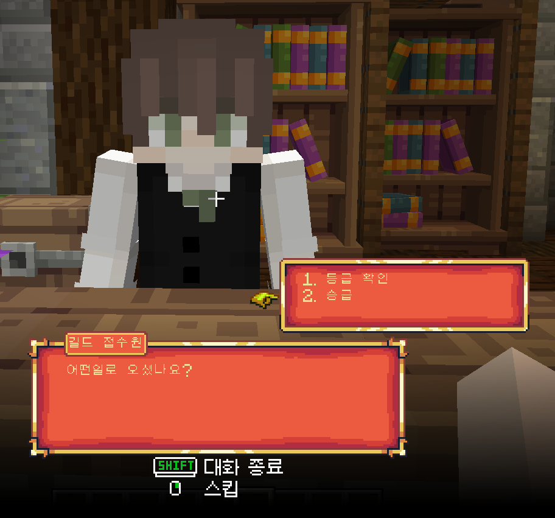

# 🎖️ 등급 / 승급


스폰 오른편 <mark style="color:blue;">**길드**</mark> 건물에서 <mark style="color:blue;">**길드 접수원**</mark>을 **우클릭** 하여 승급을 진행할 수 있습니다.\
대화창에서 마우스 **휠 키**로 번호 선택, 마우스 **우클릭**으로 선택한 대화를 진행할 수 있습니다.


<figure><figcaption></figcaption></figure>

<figure><figcaption></figcaption></figure> <figure><figcaption></figcaption></figure>

### 등급 이름과 승급 조건 및 혜택

<table><thead><tr><th width="173" align="center">등급 이름</th><th align="center">승급 조건</th><th align="center">혜택</th></tr></thead><tbody><tr><td align="center"><mark style="color:green;"><strong>방랑자</strong></mark></td><td align="center">기본 등급</td><td align="center">🏠 <a href="/broken/pages/OdEEPXtHu676PEBKazx9">셋홈</a> 저장2개 <a href="../features/virtual-system.md#undefined">가상창고 </a>9 x 1 <a href="../features/elevator.md">엘레베이터</a> 사용 가능 🏪 <a href="../economy/auction.md">거래소</a> 등록 1개</td></tr><tr><td align="center"><mark style="color:green;"><strong>탐사자</strong></mark></td><td align="center">플레이 타임 1시간 소지금5만원 직업 총합 10레벨</td><td align="center">🏠 <a href="/broken/pages/OdEEPXtHu676PEBKazx9">셋홈</a> 저장 3개 <a href="../features/virtual-system.md#undefined">가상창고 </a>9 x 2 <a href="../features/elevator.md">엘레베이터</a> 제작 가능 🏪 <a href="../economy/auction.md">거래소</a> 등록 2개 <a href="../basic-system/teleport/player-warp.md">유저워프</a> 등록 1개 /광고 사용</td></tr><tr><td align="center"><mark style="color:green;"><strong>탐험가</strong></mark></td><td align="center">플레이 타임 12시간 소지금 30만원 직업 총합 30레벨</td><td align="center">🏠 <a href="/broken/pages/OdEEPXtHu676PEBKazx9">셋홈</a> 저장 4개 <a href="../features/virtual-system.md#undefined">가상창고</a> 9 x 3 👷직업 가입 3개 🏪 <a href="../economy/auction.md">거래소</a> 등록 3개  /모루 사용</td></tr><tr><td align="center"><mark style="color:orange;"><strong>초보 정착민</strong></mark></td><td align="center">플레이 타임 7일 소지금 100만원 직업 총합 100레벨</td><td align="center">
🏠 <a href="/broken/pages/OdEEPXtHu676PEBKazx9">셋홈</a> 저장 5개 <a href="../features/virtual-system.md#undefined">가상창고</a> 9 x 4 👷직업 가입 4개

🏪 <a href="../economy/auction.md">거래소</a> 등록 5개 <a href="../basic-system/teleport/player-warp.md">유저워프</a> 등록 3개 /엔더 사용
</td></tr><tr><td align="center"><mark style="color:orange;"><strong>??? ???</strong></mark></td><td align="center">출시 예정</td><td align="center">출시 예정</td></tr><tr><td align="center"><mark style="color:orange;"><strong>???</strong></mark></td><td align="center">출시 예정</td><td align="center">출시 예정</td></tr><tr><td align="center"><mark style="color:blue;"><strong>???</strong></mark></td><td align="center">출시 예정</td><td align="center">출시 예정</td></tr><tr><td align="center"><mark style="color:blue;"><strong>???</strong></mark></td><td align="center">출시 예정</td><td align="center">출시 예정</td></tr><tr><td align="center"><mark style="color:blue;"><strong>???</strong></mark></td><td align="center">출시 예정</td><td align="center">출시 예정</td></tr></tbody></table>
