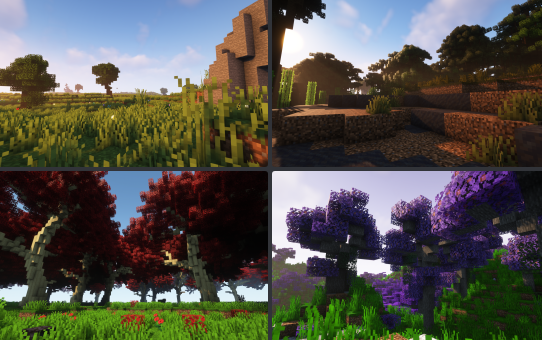

# 서브존


부동산을 여러 구역으로 나누고 각 구역의 플래그 설정을 다르게 설정할 수 있는 시스템 입니다.\
(다른 플레이어와 같이 사는 마을을 만들때 유용합니다)



서브존 내에서 **플래그 설정**을 하면 해당 **서브존의 플래그 설정**이 바뀝니다. \
서브존 내에서 **플레이어에게 권한**을 주면 해당 **서브존 내에만** 적용됩니다.


### 설정 방법

<figure><figcaption>
나무 건물을 서브존으로 지정해봅시다!
</figcaption></figure>

<figure><figcaption></figcaption></figure>

<figure><figcaption></figcaption></figure>

<figure><figcaption>
' /res subzone [서브존 이름] ' 으로 해당 영역을 서브존으로 설정할 수 있습니다.
</figcaption></figure>

<table><thead><tr><th width="340"></th><th></th></tr></thead><tbody><tr><td>/res subzone [서브존 이름]</td><td>부동산 내 선택 영역을 서브존으로 설정합니다.</td></tr><tr><td>/res remove [부동산 이름].[서브존 이름] 예시) /res remove 테스트.테스트서브</td><td>해당 서브존을 삭제합니다.</td></tr></tbody></table>

#### 사용 예시

* 서브존에서만 권한을 주면 **해당 구역만 공용 구역**으로 사용할 수 있습니다.
* 농장을 서브존으로 지정하면 테러 시 농장 외에 다른 구역의 **테러를 방지**할 수 있습니다.
