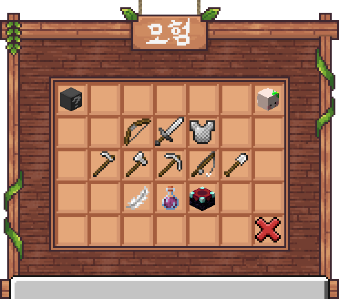

# ⚔️ 모험 레벨

<figure><figcaption>
메인 UI
</figcaption></figure>

각  활동마다 경험치를 주는 행동이 있고, 다음 레벨에 필요한 숙련도를 채우면 레벨업하며, **레벨이 높아질수록 요구 숙련도 또한 증가**합니다.

#### 레벨업 보상(기본 구조)

레벨이 오르면 보통 아래가 같이 따라옵니다.

* **스탯 상승**(능력치 버프)
* **패시브 능력(Abilities)** 해금/레벨업
* **마나 능력(Mana Ability)** 해금/레벨업

### 스킬 진행도 UI 관련 설명

UI 이미지

돋보기 아이콘을 클릭하면 해당 **경험치 획득 방법**을 확인할 수 있어요.&#x20;

상단의 트로피 아이콘을 클릭하면 **내 스킬 순위**를 확인할 수 있어요.&#x20;

보라색 아이콘을 클릭하면 해금 가능한 **능력**을 확인할 수 있어요.&#x20;

각 레벨 진행도에 커서를 올려놓으면 레벨별로 **획득 가능한 능력**을 확인할 수 있어요.

#### 내가 뭘 하면 XP가 오르는지 확인하는 법(강추)

* `/sk sources <스킬>` :&#x20;

빠른 명령어 모음
