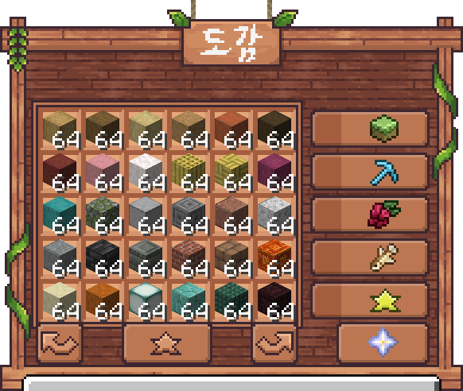

# 📒 도감


**도감을 채워서 여러 카테고리 및 진척도 보상을 획득해 보세요!**


<figure><figcaption></figcaption></figure>

## 도감 진척도 보상



#### 1단계

* 소지금 <mark style="color:blue;">**10,000원**</mark>
* 마일리지 쿠폰 <mark style="color:blue;">**1개**</mark>
* 판도라의 열쇠 <mark style="color:blue;">**1개**</mark>



#### 2단계 - 100개 등록

* 소지금 <mark style="color:blue;">**20,000원**</mark>
* 마일리지 쿠폰 <mark style="color:blue;">**2개**</mark>
* 판도라의 열쇠 <mark style="color:blue;">**2개**</mark>



#### 3단계 - 150개 등록

* 소지금 <mark style="color:blue;">**30,000원**</mark>
* 마일리지 쿠폰 <mark style="color:blue;">**3개**</mark>
* 판도라의 열쇠 <mark style="color:blue;">**3개**</mark>



#### 4단계 - 200개 등록

* 소지금 <mark style="color:blue;">**40,000원**</mark>
* 마일리지 쿠폰 <mark style="color:blue;">**4개**</mark>
* 판도라의 열쇠 <mark style="color:blue;">**4개**</mark>



#### 5단계 - 250개 등록

* 소지금 <mark style="color:blue;">**50,000원**</mark>
* 마일리지 쿠폰 <mark style="color:blue;">**5개**</mark>
* 판도라의 열쇠 <mark style="color:blue;">**5개**</mark>



#### 6단계 - 285개 등록

* 소지금 <mark style="color:blue;">**60,000원**</mark>
* 마일리지 쿠폰 <mark style="color:blue;">**10개**</mark>
* 판도라의 열쇠 <mark style="color:blue;">**5개**</mark>
* 모험 스피드 스탯 <mark style="color:blue;">**+10**</mark>



#### 7단계 - 311개 등록

* 소지금 <mark style="color:blue;">**70,000원**</mark>
* <mark style="color:blue;">**500**</mark> 마일리지
* 판도라의 열쇠 <mark style="color:blue;">**5개**</mark>
* 모험 스피드 스탯 <mark style="color:blue;">**+10**</mark>
* 모험 치명타 확률 스탯 <mark style="color:blue;">**+5**</mark>



## 도감 카테고리



### 카테고리 보상

* 소지금 <mark style="color:blue;">**100,000원**</mark>
* 판도라 열쇠 <mark style="color:blue;">**10개**</mark>
* <mark style="color:blue;">**1,000**</mark> 마일리지
* 발굴 모험 +50,000숙련도 쿠폰
* 모험 힘 스탯 <mark style="color:blue;">**+10**</mark>
* 모험 행운 스탯 <mark style="color:blue;">**+20**</mark>

### 아이템 목록

<table><thead><tr><th width="340.4444580078125">아이템</th><th>개수</th></tr></thead><tbody><tr><td>껍질 벗긴 참나무</td><td>64개</td></tr><tr><td>껍질 벗긴 가문비나무</td><td>64개</td></tr><tr><td>껍질 벗긴 자작나무</td><td>64개</td></tr><tr><td>껍질 벗긴 정글나무</td><td>64개</td></tr><tr><td>껍질 벗긴 아카시아나무</td><td>64개</td></tr><tr><td>껍질 벗긴 짙은 참나무</td><td>64개</td></tr><tr><td>껍질 벗긴 맹그로브나무</td><td>64개</td></tr><tr><td>껍질 벗긴 벚나무</td><td>64개</td></tr><tr><td>껍질 벗긴 창백한 참나무</td><td>64개</td></tr><tr><td>껍질 벗긴 대나무 블록</td><td>64개</td></tr><tr><td>대나무 모자이크</td><td>64개</td></tr><tr><td>껍질 벗긴 진홍빛 균사</td><td>64개</td></tr><tr><td>껍질 벗긴 뒤틀린 균사</td><td>64개</td></tr><tr><td>이끼 낀 조약돌</td><td>64개</td></tr><tr><td>매끄러운 돌</td><td>64개</td></tr><tr><td>조각된 석재 벽돌</td><td>64개</td></tr><tr><td>윤나는 화강암</td><td>64개</td></tr><tr><td>윤나는 섬록암</td><td>64개</td></tr><tr><td>윤나는 안산암</td><td>64개</td></tr><tr><td>심층암 타일</td><td>64개</td></tr><tr><td>조각된 응회암 벽돌</td><td>64개</td></tr><tr><td>벽돌</td><td>64개</td></tr><tr><td>진흙 벽돌</td><td>64개</td></tr><tr><td>조각된 수지 벽돌</td><td>64개</td></tr><tr><td>매끄러운 사암</td><td>64개</td></tr><tr><td>매끄러운 붉은 사암</td><td>64개</td></tr><tr><td>바다 랜턴</td><td>64개</td></tr><tr><td>프리즈머린 벽돌</td><td>64개</td></tr><tr><td>짙은 프리즈머린</td><td>64개</td></tr><tr><td>조각된 네더 벽돌</td><td>64개</td></tr><tr><td>붉은 네더 벽돌</td><td>64개</td></tr><tr><td>매끄러운 현무암</td><td>64개</td></tr><tr><td>황금이 박힌 흑암</td><td>64개</td></tr><tr><td>조각된 윤나는 흑암</td><td>64개</td></tr><tr><td>엔드 석재 벽돌</td><td>64개</td></tr><tr><td>퍼퍼 기둥</td><td>64개</td></tr><tr><td>석영 벽돌</td><td>64개</td></tr><tr><td>매끄러운 석영</td><td>64개</td></tr><tr><td>철 창살</td><td>64개</td></tr><tr><td>사슬</td><td>64개</td></tr><tr><td>자수정 블록</td><td>64개</td></tr><tr><td>싹 틔우는 자수정</td><td>1개</td></tr><tr><td>밀랍칠한 조각된 구리</td><td>64개</td></tr><tr><td>밀랍칠한 약간 녹슨 조각된 구리</td><td>64개</td></tr><tr><td>밀랍칠한 녹슨 조각된 구리</td><td>64개</td></tr><tr><td>밀랍칠한 산화된 조각된 구리</td><td>64개</td></tr><tr><td>검은색 셜커 상자</td><td>1개</td></tr><tr><td>회백색 양털</td><td>64개</td></tr><tr><td>청록색 테라코타</td><td>64개</td></tr><tr><td>하늘색 콘크리트</td><td>64개</td></tr><tr><td>자홍색 콘크리트 가루</td><td>64개</td></tr><tr><td>연두색 유광 테라코타</td><td>64개</td></tr><tr><td>갈색 색유리</td><td>64개</td></tr><tr><td>차광 유리</td><td>64개</td></tr><tr><td>파란색 초</td><td>64개</td></tr><tr><td>분홍색 현수막</td><td>16개</td></tr><tr><td>거미줄</td><td>64개</td></tr><tr><td>경작지</td><td>64개</td></tr><tr><td>거친 흙</td><td>64개</td></tr><tr><td>회백토</td><td>64개</td></tr><tr><td>균사체</td><td>64개</td></tr><tr><td>흙 길</td><td>64개</td></tr><tr><td>얼음</td><td>64개</td></tr><tr><td>꽁꽁 언 얼음</td><td>64개</td></tr><tr><td>푸른얼음</td><td>64개</td></tr><tr><td>눈 블록</td><td>64개</td></tr><tr><td>창백한 이끼 블록</td><td>64개</td></tr><tr><td>창백한 매달린 이끼</td><td>64개</td></tr><tr><td>마그마 블록</td><td>64개</td></tr><tr><td>방해석</td><td>64개</td></tr><tr><td>점적석 블록</td><td>64개</td></tr><tr><td>우는 흑요석</td><td>64개</td></tr><tr><td>영혼 모래</td><td>64개</td></tr><tr><td>뼈 블록</td><td>64개</td></tr><tr><td>빨간색 버섯 블록</td><td>64개</td></tr><tr><td>갈색 버섯 블록</td><td>64개</td></tr><tr><td>버섯불</td><td>64개</td></tr><tr><td>꽃 핀 진달래</td><td>64개</td></tr><tr><td>말린 켈프 블록</td><td>64개</td></tr><tr><td>거품 산호 블록</td><td>64개</td></tr><tr><td>죽은 관 산호 블록</td><td>64개</td></tr><tr><td>젖은 스펀지</td><td>64개</td></tr><tr><td>잭오랜턴</td><td>64개</td></tr><tr><td>벌집 조각 블록</td><td>64개</td></tr><tr><td>슬라임 블록</td><td>64개</td></tr><tr><td>꿀 블록</td><td>64개</td></tr><tr><td>스컬크 촉매</td><td>64개</td></tr><tr><td>스컬크 비명체</td><td>64개</td></tr><tr><td>스컬크 감지체</td><td>64개</td></tr><tr><td>진줏빛 개구리불</td><td>64개</td></tr></tbody></table>



### 카테고리 보상

* 소지금 <mark style="color:blue;">**100,000원**</mark>
* 판도라 열쇠 <mark style="color:blue;">**10개**</mark>
* <mark style="color:blue;">**1,000**</mark> 마일리지
* 채광 모험 +50,000숙련도 쿠폰
* 모험 재생력 스탯 <mark style="color:blue;">**+10**</mark>
* 모험 행운 스탯 <mark style="color:blue;">**+20**</mark>

### 아이템 목록

<table><thead><tr><th width="339.666748046875">아이템</th><th>개수</th></tr></thead><tbody><tr><td>석탄 광석</td><td>64개</td></tr><tr><td>심층암 석탄 광석</td><td>64개</td></tr><tr><td>철 광석</td><td>64개</td></tr><tr><td>심층암 철 광석</td><td>64개</td></tr><tr><td>구리 광석</td><td>64개</td></tr><tr><td>심층암 구리 광석</td><td>64개</td></tr><tr><td>금 광석</td><td>64개</td></tr><tr><td>심층암 금 광석</td><td>64개</td></tr><tr><td>레드스톤 광석</td><td>64개</td></tr><tr><td>심층암 레드스톤 광석</td><td>64개</td></tr><tr><td>에메랄드 광석</td><td>64개</td></tr><tr><td>심층암 에메랄드 광석</td><td>16개</td></tr><tr><td>청금석 광석</td><td>64개</td></tr><tr><td>심층암 청금석 광석</td><td>64개</td></tr><tr><td>다이아몬드 광석</td><td>64개</td></tr><tr><td>심층암 다이아몬드 광석</td><td>64개</td></tr><tr><td>네더 금 광석</td><td>64개</td></tr><tr><td>네더 석영 광석</td><td>64개</td></tr><tr><td>고대 잔해</td><td>64개</td></tr><tr><td>네더라이트 주괴</td><td>64개</td></tr><tr><td>작은 자수정 봉오리</td><td>64개</td></tr><tr><td>중간 자수정 봉오리</td><td>64개</td></tr><tr><td>큰 자수정 봉오리</td><td>64개</td></tr><tr><td>숯</td><td>64개</td></tr></tbody></table>



### 카테고리 보상

* 소지금 <mark style="color:blue;">**100,000원**</mark>
* 판도라 열쇠 <mark style="color:blue;">**10개**</mark>
* <mark style="color:blue;">**1,000**</mark> 마일리지
* 농사 모험 +50,000숙련도 쿠폰
* 모험 체력 스탯 <mark style="color:blue;">**+10**</mark>
* 모험 행운 스탯 <mark style="color:blue;">**+20**</mark>

### 아이템 목록

<table><thead><tr><th width="339.666748046875">아이템</th><th>개수</th></tr></thead><tbody><tr><td>건초 더미</td><td>64개</td></tr><tr><td>황금 당근</td><td>64개</td></tr><tr><td>네더 사마귀</td><td>64개</td></tr><tr><td>비트</td><td>64개</td></tr><tr><td>코코아 콩</td><td>64개</td></tr><tr><td>수박</td><td>64개</td></tr><tr><td>호박 파이</td><td>64개</td></tr><tr><td>반짝이는 수박 조각</td><td>64개</td></tr><tr><td>발광 열매</td><td>64개</td></tr><tr><td>달콤한 열매</td><td>64개</td></tr><tr><td>독이 있는 감자</td><td>64개</td></tr><tr><td>구운 감자</td><td>64개</td></tr><tr><td>황금 사과</td><td>64개</td></tr><tr><td>마법이 부여된 황금 사과</td><td>1개</td></tr><tr><td>선인장</td><td>64개</td></tr><tr><td>후렴과</td><td>64개</td></tr><tr><td>벌레잡이풀 꼬투리</td><td>64개</td></tr><tr><td>케이크</td><td>1개</td></tr><tr><td>쿠키</td><td>64개</td></tr><tr><td>블랙베리</td><td>64개</td></tr><tr><td>블루베리</td><td>64개</td></tr><tr><td>크랜베리</td><td>64개</td></tr><tr><td>엘더베리</td><td>64개</td></tr><tr><td>라즈베리</td><td>64개</td></tr><tr><td>오이</td><td>64개</td></tr><tr><td>포도</td><td>64개</td></tr><tr><td>키위</td><td>64개</td></tr><tr><td>완두콩</td><td>64개</td></tr><tr><td>토마토</td><td>64개</td></tr></tbody></table>



### 준비중



### 카테고리 보상

* 소지금 <mark style="color:blue;">**100,000원**</mark>
* 판도라 열쇠 <mark style="color:blue;">**10개**</mark>
* <mark style="color:blue;">**1,000**</mark> 마일리지
* 전투 모험 +50,000숙련도 쿠폰
* 모험 치명타 스탯 <mark style="color:blue;">**+5**</mark>
* 모험 단단함 스탯 <mark style="color:blue;">**+10**</mark>
* 모험 힘 스탯 <mark style="color:blue;">**+10**</mark>

### 아이템 목록

<table><thead><tr><th width="339.666748046875">아이템</th><th>개수</th></tr></thead><tbody><tr><td>팬텀 막</td><td>64개</td></tr><tr><td>마그마 크림</td><td>64개</td></tr><tr><td>블레이즈 막대기</td><td>64개</td></tr><tr><td>브리즈 막대기</td><td>64개</td></tr><tr><td>엔더의 눈</td><td>64개</td></tr><tr><td>가스트 눈물</td><td>64개</td></tr><tr><td>마른 가스트</td><td>64개</td></tr><tr><td>무거운 코어</td><td>16개</td></tr><tr><td>크리킹 심장</td><td>16개</td></tr><tr><td>바다의 심장</td><td>64개</td></tr><tr><td>앵무조개 껍데기</td><td>64개</td></tr><tr><td>아르마딜로 인갑</td><td>64개</td></tr><tr><td>거북 인갑</td><td>64개</td></tr><tr><td>발광 먹물 주머니</td><td>64개</td></tr><tr><td>먹물 주머니</td><td>64개</td></tr><tr><td>안장</td><td>1개</td></tr><tr><td>이름표</td><td>64개</td></tr><tr><td>끈</td><td>64개</td></tr><tr><td>불사의 토템</td><td>1개</td></tr><tr><td>삼지창</td><td>1개</td></tr><tr><td>겉날개</td><td>1개</td></tr><tr><td>다이아몬드 말 갑옷</td><td>1개</td></tr><tr><td>횃불꽃</td><td>16개</td></tr><tr><td>스니퍼 알</td><td>16개</td></tr><tr><td>메아리 조각</td><td>64개</td></tr><tr><td>토끼 발</td><td>64개</td></tr><tr><td>음반 (13)</td><td>1개</td></tr><tr><td>음반 (cat)</td><td>1개</td></tr><tr><td>음반 (blocks)</td><td>1개</td></tr><tr><td>음반 (chirp)</td><td>1개</td></tr><tr><td>음반 (far)</td><td>1개</td></tr><tr><td>음반 (mall)</td><td>1개</td></tr><tr><td>음반 (mellohi)</td><td>1개</td></tr><tr><td>음반 (stal)</td><td>1개</td></tr><tr><td>음반 (strad)</td><td>1개</td></tr><tr><td>음반 (ward)</td><td>1개</td></tr><tr><td>음반 (11)</td><td>1개</td></tr><tr><td>음반 (wait)</td><td>1개</td></tr><tr><td>음반 (Precipice)</td><td>1개</td></tr><tr><td>음반 (otherside)</td><td>1개</td></tr><tr><td>음반 (Relic)</td><td>1개</td></tr><tr><td>음반 (5)</td><td>1개</td></tr><tr><td>음반 (Creator)</td><td>1개</td></tr><tr><td>음반 (Creator 오르골)</td><td>1개</td></tr><tr><td>음반 (Precipice)</td><td>1개</td></tr><tr><td>음반 (Tears)</td><td>1개</td></tr><tr><td>음반 (Lava Chicken)</td><td>1개</td></tr><tr><td>심장 도자기 조각</td><td>16개</td></tr><tr><td>찢어진 심장 도자기 조각</td><td>16개</td></tr><tr><td>짖음 도자기 조각</td><td>16개</td></tr><tr><td>광부 도자기 조각</td><td>16개</td></tr><tr><td>애도자 도자기 조각</td><td>16개</td></tr><tr><td>풍부 도자기 조각</td><td>16개</td></tr><tr><td>보물 도자기 조각</td><td>16개</td></tr><tr><td>긁개 도자기 조각</td><td>16개</td></tr><tr><td>다발 도자기 조각</td><td>16개</td></tr><tr><td>피신처 도자기 조각</td><td>16개</td></tr><tr><td>해골 도자기 조각</td><td>16개</td></tr><tr><td>콧바람 도자기 조각</td><td>16개</td></tr><tr><td>낚시꾼 도자기 조각</td><td>16개</td></tr><tr><td>궁수 도자기 조각</td><td>16개</td></tr><tr><td>만세 도자기 조각</td><td>16개</td></tr><tr><td>칼날 도자기 조각</td><td>16개</td></tr><tr><td>양조가 도자기 조각</td><td>16개</td></tr><tr><td>불탐 도자기 조각</td><td>16개</td></tr><tr><td>위험 도자기 조각</td><td>16개</td></tr><tr><td>탐험가 도자기 조각</td><td>16개</td></tr><tr><td>친구 도자기 조각</td><td>16개</td></tr><tr><td>흐름 도자기 조각</td><td>16개</td></tr><tr><td>소용돌이 도자기 조각</td><td>16개</td></tr><tr><td>보초 갑옷 장식</td><td>16개</td></tr><tr><td>백스 갑옷 장식</td><td>16개</td></tr><tr><td>야생 갑옷 장식</td><td>16개</td></tr><tr><td>해안 갑옷 장식</td><td>16개</td></tr><tr><td>사구 갑옷 장식</td><td>16개</td></tr><tr><td>길잡이 갑옷 장식</td><td>16개</td></tr><tr><td>사육사 갑옷 장식</td><td>16개</td></tr><tr><td>조형가 갑옷 장식</td><td>16개</td></tr><tr><td>주인 갑옷 장식</td><td>16개</td></tr><tr><td>파수 갑옷 장식</td><td>16개</td></tr><tr><td>고요 갑옷 장식</td><td>16개</td></tr><tr><td>물결 갑옷 장식</td><td>16개</td></tr><tr><td>돼지 코 갑옷 장식</td><td>16개</td></tr><tr><td>갈비뼈 갑옷 장식</td><td>16개</td></tr><tr><td>눈 갑옷 장식</td><td>16개</td></tr><tr><td>첨탑 갑옷 장식</td><td>16개</td></tr><tr><td>흐름 갑옷 장식</td><td>16개</td></tr><tr><td>나사 갑옷 장식</td><td>16개</td></tr></tbody></table>


