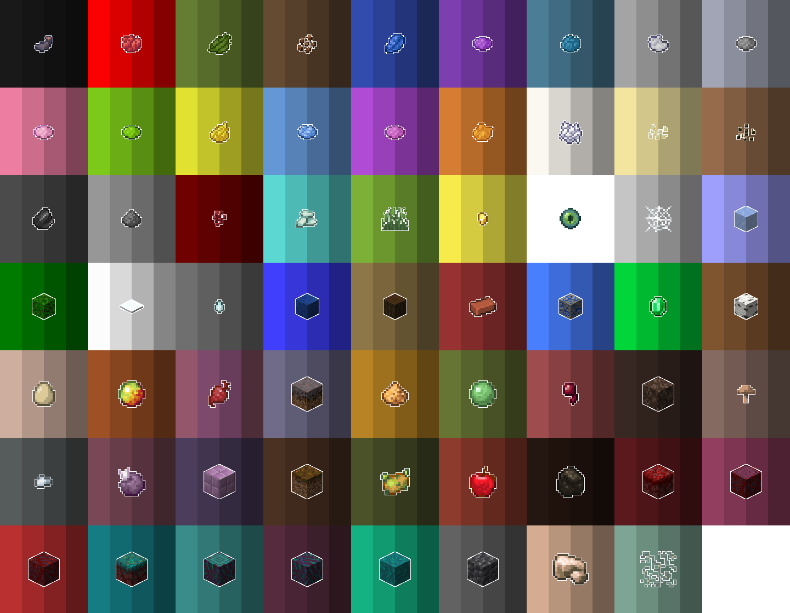

# 🎨 그림

### 명령어 

<table><thead><tr><th width="201.33333333333331">명령어</th><th width="204">설명</th><th>기타</th></tr></thead><tbody><tr><td>/그림 /art</td><td> 그림 메인 메뉴 오픈</td><td></td></tr><tr><td>/그림 저장 <strong>&#x3C;제목></strong> /art save <strong>&#x3C;제목></strong></td><td>작품을 [제목]으로 지정</td><td>[제목] - 3~16 글자 - 글자, 숫자, '_' 만 가능 - 공백 포함 시 이전까지만 인식   예) <mark style="color:red;">(x) '나는 테스트' -> '나는'</mark>         <mark style="color:green;">(o) '나는_테스트' ->  '나는_테스트'</mark> </td></tr><tr><td><strong>/art preview &#x3C;제목></strong></td><td>작품 미리보기</td><td></td></tr><tr><td>/art clear </td><td>캔버스 지우기</td><td></td></tr></tbody></table>

### 작품 복사

그림 메인 메뉴에서 복사할 수 있어요!

본인 작품만 가능합니다.

그림 아이템> 작품 선택 > 빈지도 우클릭

### 작품 편집 

이젤에 작품을 우클릭 하면 작품을 편집할 수 있어요!

원작에는 영향이 없으며, 새로운 작품으로 저장돼요

#### 도구

<table><thead><tr><th width="109.33333333333331">아이템</th><th width="281">조합법</th><th>사용법</th></tr></thead><tbody><tr><td>이젤</td><td></td><td>땅에 우클릭</td></tr><tr><td>캔버스</td><td></td><td>이젤에 우클릭</td></tr><tr><td>물감</td><td>아래 팔레트 참조</td><td>
이젤에 앉은 후 캔버스를: 좌클릭 - 점(픽셀) 단위로  그리기

우클릭 - 선 그리기
</td></tr><tr><td>깃털</td><td></td><td>[명도  조절]  클릭 시 색깔이 밝아져요</td></tr><tr><td>석탄</td><td></td><td>[명도  조절] 클릭 시 색깔이 어두워져요 (2단계 까지)</td></tr><tr><td>양동이</td><td></td><td>왼손에 물감, 오른손에 양동이 채우기 채우기 취소</td></tr><tr><td>스펀지</td><td></td><td>스포이드</td></tr><tr><td>나침반</td><td></td><td>그림 회전</td></tr><tr><td>저장</td><td></td><td>저장</td></tr></tbody></table>

### 물감 팔레트

<figure><figcaption>
1번색: 깃털 사용 2번색: 원래 색깔 3번색: 석탄 1단계 4번색: 석탄 2단계 ⚠️ 엔더눈 : 투명
</figcaption></figure>
