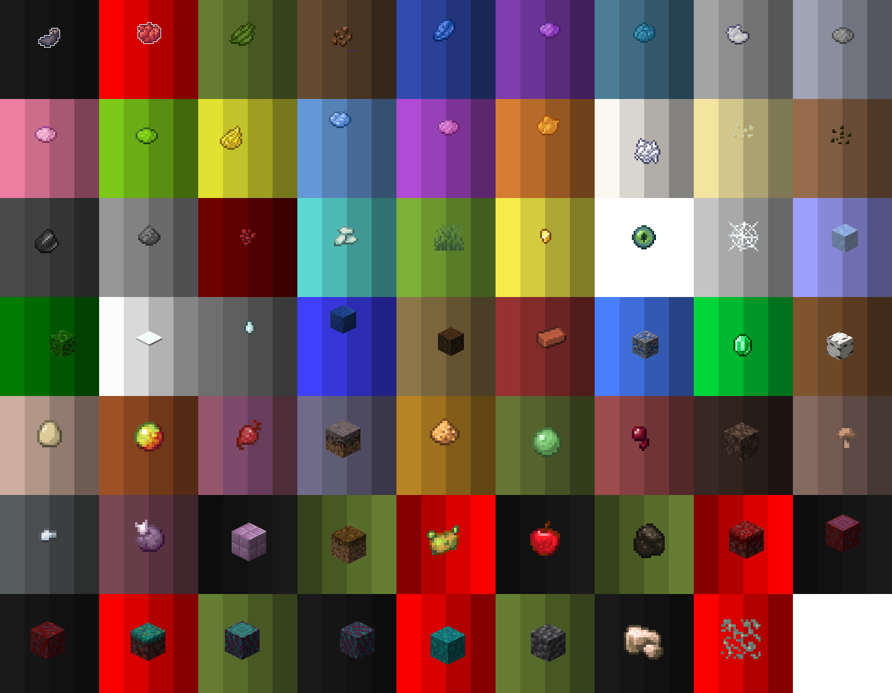

# 🎨 그림

### 명령어 

* **/artmap** - 미술 메인 메뉴 오픈하기
* **/artmap save <제목>** - 작품을 \[제목]으로 지정하기
  * \[제목]은 3\~16글자 사이로 설정가능해요.\
    글자, 숫자, '\_' 만 가능하며, 공백을 넣으면 그 이전까지만 인식돼요\
    예) '나는 테스트' -> '나는'\
    &#x20;     옳은 방법 : 나는\_테스트&#x20;
* **/artmap preview \<title>** - 작품 미리보기
* /artmap clear - 캔버스 지우기

### 작품 복사

미술 메인 메뉴에서 복사할 수 있어요!

본인 작품만 가능합니다.

그림 아이템> 작품 선택 > 빈지도 우클릭

### 작품 편집 

이젤에 작품을 우클릭 하면 작품을 편집할 수 있어요!

원작에는 영향이 없으며, 새로운 작품으로 저장돼요

#### 도구

<table><thead><tr><th width="109.33333333333331"></th><th width="319">조합법</th><th></th></tr></thead><tbody><tr><td>이젤</td><td></td><td>땅에 우클릭</td></tr><tr><td>캔버스</td><td></td><td>이젤에 우클릭</td></tr><tr><td>물감</td><td>아래 팔레트 참조</td><td>
이젤에 앉은 후 캔버스에 우클릭 하면 캔버스를 색칠할 수 있어요 좌클릭 - 점(픽셀) 단위로  그리기

우클릭 - 선 그리기
</td></tr><tr><td>깃털</td><td></td><td>[명도  조절]  클릭 시 색깔이 밝아져요</td></tr><tr><td>석탄</td><td></td><td>[명도  조절] 클릭 시 색깔이 어두워져요 (2단계 까지)</td></tr><tr><td>양동이</td><td></td><td>왼손에 물감, 오른손에 양동이 채우기 채우기 취소</td></tr><tr><td>스펀지</td><td></td><td>스포이드</td></tr><tr><td>나침반</td><td></td><td>그림 회전</td></tr><tr><td>저장</td><td></td><td>저장</td></tr></tbody></table>

물감 팔레트

<figure><figcaption>
아직 미완성이에요! (후렴과 까지 완료) 자유분방한 아이템 위치도 수정될거에요 1번색: 깃털 사용 2번색: 원래 색깔 3번색: 석탄 1단계 4번색: 석탄 2단계
</figcaption></figure>

